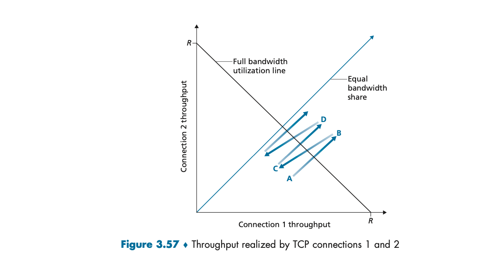
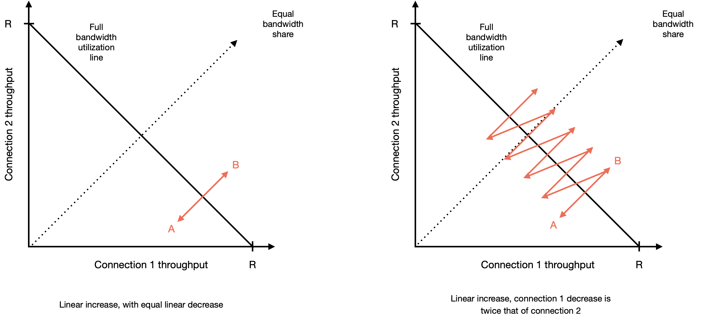

#  CS 664 Computer Networks

---

Homework 3

Name:  Morgan Bergen

WSU ID:  B493R546

Date:  July 8 2024

Due:  July 12 2024

---

**1.  Consider that only a single TCP (Reno) connection uses one 10 mbps link which does not buffer any data.  Suppose that this link is the only congested link between the sending and receiving hosts.  Assume that the TCP sender has a huge file to send to the receiver, and the receiver's receive buffer is much larger than the congestion window.  We also make the following assumptions:  each TCP segment size is 1,500 bytes; the two-way propagation delay of this connection is 150 msec; and this TCP connection is always in congestion avoidance phase, that is, it ignores slow start.**

**a.  What is the maximum window size (in segments) that this TCP connection can achieve?**

Given the following:

- $LC$ = link capacity = 10 mbps = $10 * 10^6$ bps = $1.25 * 10^6$ bytes/sec
- $RTT$ = round trip time = 150 msec = 0.15 sec
- $MSS$ = tcp segment size = 1,500 bytes
- $W$ = maximum window size in segments

$$
LC = \frac{W \times MSS}{RTT}
\\~\\~\\
1.25 \times 10^6 = \frac{W \times 1,500}{0.15}
\\~\\~\\
\left( 1.25 \times 10^6 \right) \times  \frac{0.15}{1,500} = \frac{W \times 1,500}{0.15} \times  \frac{0.15}{1,500}
\\~\\~\\
W = \left( 1.25 \times 10^6 \right) \times  \frac{0.15}{1,500}
\\~\\~\\
W = 125
$$

Therefore the maximum window size that this TCP connection can achieve is 125 segments.

**b.  What is the average window size (in segments) and average throughput (in bps) of this TCP connection?**

-  $W_{avg}$ = average window size in segments
-  $T_{avg}$ = average throughput in bps
-  $W = 125$ segments

The average window size of this TCP connection is given by the formula:

$$
W_{avg} = \frac{W/2 + 2}{2}
\\~\\~\\
W_{avg} = \frac{125/2 + 125}{2}
\\~\\~\\
W_{avg} = 93.75
$$

Therefore the average window size of this TCP connection is 93.75 segments.

The average throughput of this TCP connection is given by the formula:

$$
T_{avg} = \frac{W_{avg} \times MSS}{RTT}
\\~\\~\\
T_{avg} = \frac{93.75 \times 1,500}{0.15}
$$

Therefore the average throughput of this TCP connection is $937,500$ bps.

**c.  How long would it take for this TCP connection to reach its maximum window again after recovering from a packet loss?**

The time needed to increase the window size to its maximum is
$$
W_{max} = \text{window size / 2} * RTT
\\~\\~\\
W_{max} = 125 / 2 * 0.15
\\~\\~\\
W_{max} = 9.375 \text{ seconds}
$$

Therefore the time needed to increase the window size to its maximum is 9.375 seconds.

2.  refer to the figure below, which illustrates the convergence of TCP's AIMD algorithm.  Suppose that instead of a multiplicative decrease, TCP decreased the window size by a constant amount.  Would the resulting AIAD algorithm converge to an equal share algorithm?  Justify your answer using a diagram similar to the figure below.

<p align=center>
    
</p>

<p align=center>
    
</p>

Instead of a multiplicative decrease, if instead the window size was decreased by a constant amount then the AIAD algorithm would not converge to an equal amount.  If both connections were to be decreased by a constant amount the total throughput would never increase to its maximum amount.  if connection 1 were to decrease by a greater amount than connection 2, connection 1 would have no throughput and connection 2 would have all of the throughput.

**3.  Suppose two packets arrive to two different input ports of a router at exactly the same time.  Also suppose there are no other packets anywhere in the router.**

**a.  Suppose the two packets are to be forwarded to two different output ports.  Is it possible to forward the two packets through the switch fabric at the same time when the fabric uses a shared bus?**

No, only one packet can be transmitted at a time through a shared bus.

**b.  Suppose the two packets are to be forwarded to two different output ports.  Is it possible to forward the two packets through the switch fabric at the same time when the fabric uses a crossbar?**

It is possible to forward both packets through the switch at the same time, but only if they both have different destinations.

**c.  Suppose the two packets are to be forwarded to the same output port.  Is it possible to forward the two packets through the switch fabric at the same time when the fabric uses a crossbar?**

No it is not possible to forward two packets at the same time through the router to one output port.  The crossbar allows multiple packets through, they cannot be at the same place at the same time.

**4.  Consider the datagram network using 32-bit host addresses.  Suppose a router has four links, numbered 0 through 3, and packets are to be forwarded to the link interfaces as follows:**

```
Destination Address Range                        Link interface
-------------------------------------------------------------------
11100000 00000000 00000000 00000000              0
through
11100000 00111111 11111111 11111111

11100000 01000000 00000000 00000000              1
through
11100000 01000000 11111111 11111111

11100000 01000001 00000000 00000000              2
through
11100001 01111111 11111111 11111111

otherwise                                        3
```

**a.  Provide a forwarding table that has five entries, uses longest prefix matching, and forwards packets to the correct link interfaces.**

```
Prefix Match                                    Link interface
-------------------------------------------------------------------
11100000 00                                     0

11100000 01000000                               1

1110000                                         2

otherwise                                       3
```

**b.  Describe how your following table determines the appropriate link interface for datagrams with destination addresses:**

The router checks the destination address against each prefix in the table.  It uses the longest matching prefix to decide the link interface.  If no specific prefix matches, the address is forwarded to the default link (link 3).

-  prefix `11100000 00` is matched to link 0 because it is the longest matching prefix
    +  example: `111000 00000000 00000000 00000001`
-  prefix `11100000 01000000` is matched to link 1 because it is the longest matching prefix
    +  example: `11100000 01000000 00000000 00000001`
-  prefix `1110000` is matched to link 2 because it is the longest matching prefix
    +  example: `11100000 01000001 00000000 00000001`
-  otherwise is matched to link 3 because it is the longest matching prefix
    +  example:  `11000000 00000000 00000000 00000001`


