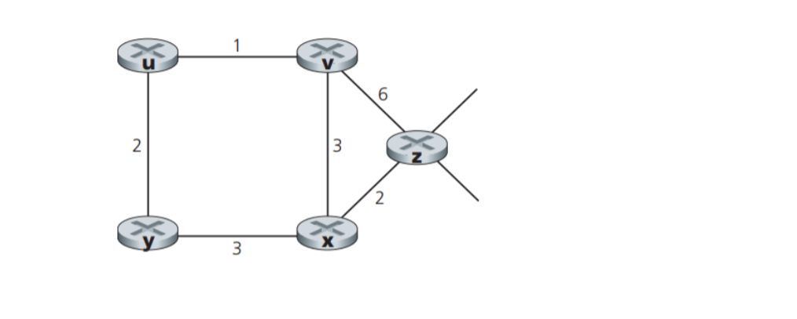

#  cs 664 computer networks

---

homework 4

name:  morgan bergen

wsu id:  b493r546

date:  july 15 2024

due:  july 19 2024

---

1.  consider the following network with the indicated link costs, use dijkstra's shortest-path algorithm, and showing your work using a table similar to our lecture table for dijkstra's shortest path algorithm, compute the shortest path from 't' to all network nodes.

<p align=center>
    
<p>

**given information**

-  $c_{x, y}$:  direct link cost from node $x$ to node $y$; $= \infty$ if not direct neighbors
-  $D(v)$:  current estimate of cost of least-cost-path from source to destination $v$
-  $p(v)$:  predecessor node along path from source to $v$
-  $N'$: set of nodes whose least cost path definitively known

```pseudo
initialization:
    N' = {t}
    for all nodes v
        if v adjacent to t
            then D(v) = c_{t, v}
        else D(v) = ∞

loop:
    find w not in N' such that D(w) is a minimum
    add w to N'
    update D(v) for all v adjacent to w and not in N':
        D(v) = min(D(v), D(w) + c_{w, v})
        
        /* new least path cost to v is either old least cost path to v or known
        least cost path to w plus direct cost from w to v */

    until all node in N'
```
**running the link state algorithm on the network with the following table**

| step  | $N'$     | $D(u), p(u)$ | $D(v), p(v)$ | $D(w), p(w)$ | $D(x), p(x)$ | $D(y), p(y)$ | $D(z), p(z)$ |
| :---: | :---:    | :----------: | :----------: | :----------: | :----------: | :----------: | :----------: |
| 0     | t        | **2,t**      | 4,t          | ∞            | ∞            | 7,t          | ∞            |
| 1     | tu       |              | 4,t          | 5,u          | ∞            | ∞            | ∞            |
| 2     | tuv      |              |              | **5,u**      | 7,v          | 12,v         | ∞            |
| 3     | tuvw     |              |              |              | **7,v**      | ∞            | ∞            |
| 4     | tuvwx    |              |              |              |              | **13,x**     | 15,x         |
| 5     | tuvwxy   |              |              |              |              |              | **15,x**     |


**least cost path and forwarding table for node t**

| destination | link       |
|:-----------:|:----------:|
| u           | (t, u)     |
| v           | (t, u)     |
| w           | (t, u)     |
| x           | (t, u)     |
| y           | (t, u)     |
| z           | (t, u)     |


**steps of the algorithm**
```
step 1
D(v) = min(D(v), D(u) + c_{u, v}) = min(4, 2 + 3) = 4
D(w) = min(D(w), D(u) + c_{u, w}) = min(∞, 2, + 3) = 5
```

```
step 2
D(w) = min(D(w), D(v) + c_{v, w}) = min(5, 4 + 4) = 5
D(x) = min(D(x), D(v) + c_{v, x}) = min(∞, 4 + 3) = 7
D(y) = min(D(y), D(v) + c_{v, y}) = min(∞, 4 + 8) = 12
```

```
step 3
D(x) = min(D(x), D(w) + c_{w, x}) = min(7, 5 + 6) = 7
```

```
step 4
D(y) = min(D(y), D(x) + c_{x, y}) = min(∞, 7 + 6) = 13
D(z) = min(D(z), D(x) + c_{x, z}) = min(∞, 7 + 8) = 15
```

```
step 5
D(z) = min(D(z), D(y) + c_{y, z}) = min(15, 7 + 12) = 15
```

**2.  consider the network shown below, and assume that each node initially knows the costs to each of its neighbors.  consider the distance vector algorithm and show the distance table entries at node z.**

<p align=center>
    
<p>

node z will only know the cost of each of its neighbors, (v and x) initially

|     |  u  |  v  |  x  |  y  |  z  |
|:---:|:---:|:---:|:---:|:---:|:---:|
|  v  | ∞   | ∞   | ∞   | ∞   | ∞   |
|  x  | ∞   | ∞   | ∞   | ∞   | ∞   |
|  z  | ∞   | 6   | 2   | ∞   | 0   |

next we will check adjacent nodes using x and v, in order to find routes to u and y

|   | u | v | x | y | z |
|:-:|:-:|:-:|:-:|:-:|:-:|
| v | 1 | 0 | 3 | ∞ | 6 |
| x | ∞ | 3 | 0 | 3 | 2 |
| z | 7 | 5 | 2 | 5 | 0 |

optimal routes are now computed as

|   | u | v | x | y | z |
|:-:|:-:|:-:|:-:|:-:|:-:|
| v | 1 | 0 | 3 | 3 | 5 |
| x | 4 | 3 | 0 | 3 | 2 |
| z | 6 | 5 | 2 | 5 | 0 |

**3.  consider the router and the three attached subnets below a, b, and c.  the number of hosts is also shown below.  the subnets share the 24 high order bits of the address space: `10.245.76.0/24`.  assign subnet addresses to each of the subnets a, b, and c so that the amount of address space assigned is minimal, and the same time leaving the largest possible contiguous address space available for assignment if a new subnet were to be added.  then answer the questions below**

<p>
    
</p>

**a.  is the address space public or private?  how many hosts can there be in this address space?**

the address is private.

total hosts in a /24 network is $2^8 - 2 = 256 - 2 = 254$ addresses available accounting for subnet id and broadcast addresses

**b.  what is the subnet address or network address, host range, and broadcast address of subnet a?**

-  hosts required = 55
-  number of addresses required = 55 + 2 = 57 addresses
-  smallest power of 2 greater than or equal to 57 = $2^6 = 64$ addresses
-  subnet mask = `255.255.255.192/26` provides 64 addresses
-  subnet address = `10.245.76.0/26`
-  broadcast address = `10.245.76.63`
-  host range = `10.245.76.1` - `10.245.76.62`

**c.  what is the subnet address or network address, host range, and broadcast address of subnet b?**

-  hosts required = 68 hosts
-  number of addresses required = 68 + 2 = 70 addresses
-  smallest power of 2 greater than or equal to 70 = $2^7 = 128$ addresses
-  subnet mask = `255.255.255.128/25` provides 128 addresses
-  subnet address = `10.245.76.64/25`
-  broadcast address = `10.245.76.191`
-  host range = `10.245.76.65` - `10.245.76.190`

**d.  what is the subnet address or network address, host range, and broadcast address of subnet c?**

-  hosts required = 33
-  number of address required = 33 + 2 = 25
-  smallest power of 2 greater than or equal to 35 = $2^6 = 64$ addresses
-  subnet mask = `255.255.255.192/26` provides 64 addresses
-  subnet address = `10.245.76.192/26`
-  broadcast address = `10.245.76.255`
-  host range = `10.245.76.193` - `10.245.76.254`

**4.  consider the count to infinity problem in distance vector routing.  will the count to infinity problem occur if we decrease the cost of a link?  why?  how about if we connect two nodes which do not have a link?**

no, by decreasing link cost we would not cause a loop caused by the next hop relation between two nodes of that link.  connecting two nodes with a link is the same as decreasing the link weight for infinite to the finite weight. 


