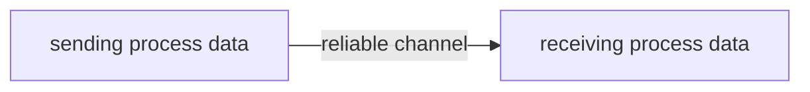
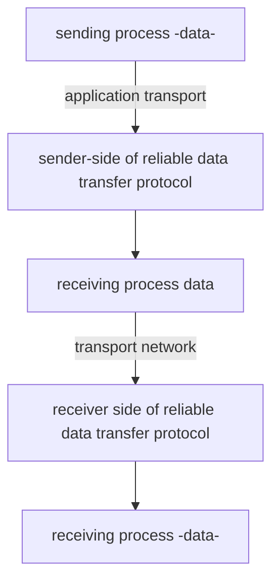
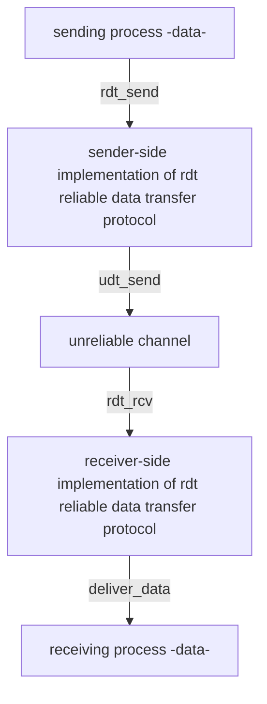
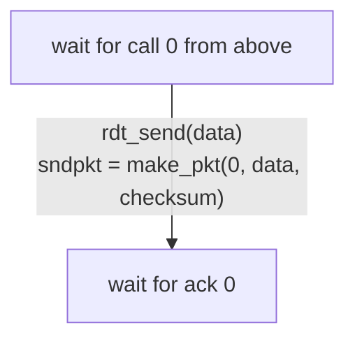

#  computer networks 
##  transport layer

-  how can two entities reliably communicate over a channel in which messages can be corrupted or lost?
-  how can two distributed entities synchronize and share state?
-  how can a collection of different entities adjust their communication rates to prevent network congestion and resource exaustion?
-  the two main transport protocols are udp and tcp

###  overview

-  understand principles behind transport layer services
    +  multiplexing and demultiplexing
    +  reliable data transfer
    +  flow control
    +  congestion control
-  learn about internet transport layer protocols
    +  udp:  connectionless transport
    +  tcp:  connection-oriented reliable transport
    +  tcp congestion control

###  transport services and protocols

-  provide logical communication between application processes running on different hosts
-  transport protocols actions in end systems
    +  sender:  breaks application messages into segments and passes the segments to the network layer
    +  receiver:  reassembles segments into messages and passes the messages to the application layer
-  two transport protocols available to internet applications
    +  udp user datagram protocol
    +  tcp transmission control protocol

###  transport vs. network layer services and protocols

###  principles of reliable data transfer

-  channel model
-  realistic assumptions
-  protocol mechanisms

reliable service abstraction



**reliable service implementation**


-  complexity of reliable data transfer protocol will depend strongly on characteristics of unreliable channel (lose, corrupt, reorder data?
-  sender, receiver do not know the state of each other, e.g. was a message received?
    +  unless communicated via a message



-  **`rdt_send()`**  called from above (e.g. by app) passed data to deliver to receiver upper level
-  **`udt_send()`**  called by `rdt` to transfer packet over unreliable channel to receiver
-  **`rdt_rcv()`**  called when a packet arrives on receiv er side of channel
-  **`deliver_data()`** called by `rdt` to deliver data to upper layer

###  reliable data transfer:  getting started

-  we will incrementally develop send,er receiver sides of reliable data transfer protocol (`rdt`)
-  consider only unidirectional data transfer
    +  but control info will flow in both directions
-  use finite state machines (FSM) to specify sender, receiver

-  what do we really mean when we say RDT senders in a given state or a receiver is in a given state?
-  think about a link being transmitting state or in an idle state
-  think about the notion of there being transitions between states
-  transitions are happening because of an event that takes place
-  think about actions that are taken by the system

###  `rdt1.0`:  reliable transfer over a reliable channel

-  underlying channel is perfectly reliable
    +  no bit errors
    +  no loss of packets
-  separate FSMS for sender, receiver
    +  sender sends data into underlying channel
    +  receiver reads data from underlying channel

**finite state machine figure**

**sender** [wait for call from above] 

`rdt_send(data)`, `packet = make_pkt(data)`, `udt_send(packet)`

**receiver** [wait for call from below]

`rdt_rcv(packet)`, `extract(packet, data)`, `deliver_data(data)`

###  `rdt2.0`:  channel with bit errors

-  underlying channel may flip bits in packet
    +  checksum to detect bit errors
-  the question:  how to recover from errors
    +  acknowledgements (ACKs): receiver explicitly tells sender that pkt received OK
    +  negative acknowledgements (NAKs):  receiver explicitly tells sender that pkt had errors
    +  sender restransmits pkt on receipt of NAK

**stop and wait**

-  sender sends one packet, then waits for receiver response

```
[wait for call from above] -----> [wait for ACK or NAK]
^                                                     |
|_____________________________________________________|
```

###  `rdt2.0` has a fatal flaw

-  what happens if ack / nak corrupted?
    +  sender doesnt know what happened at receiver
    +  can't just retransmit: possible duplicate

**handling duplicates**
-  sender retransmits current pkt if ACK/NAK corrupted
-  sender adds sequence number to each pkt
-  receiver discards (doesn't deliver up) duplicate pkt

**stop and wait**
-  sender sneds one packet, then waits for receiver response

###  `rdt2.1`  discussion

**sender**
-  sequence number added to pkt
-  two sequences numbers (0, 1) will suffice
-  must check of received ACK/NAK corrupted
-  twice as many states
    +  state must remember whether expected pkt should have sequence number of 0 or 1

**receiver**
-  must check of received packet is duplicate
    +  state indicates whether 0 or 1 is expected pkt sequence number
-  note: receiver can not know if its last ACK/NAK received okay at sender

###  rdt protocol mechanisms
-  error detection (e.g. checksum)
-  acks, naks
-  retransmission
-  sequence numbers (duplicate detection)

###  rdt3.0:  channels with errors and loss

**new channel assumption**:  underlying channel can also lose packets (data, acks)
-  checksum, sequence #s, acks, retransmissions will be of help but not quite enough

**approach**:  sender waits for a reasonable amount of time for ack
-  retransmits if no acknowledged received in this time
-  if pkt (or ack) just delayed (not lost):
    +  retransmission will be duplicated, but the sequence numbers already handles this
    +  receiver must specify sequence number of packet being acknowledged
-  use countdown timer to interrupt after reasonable amount of time



###  performance of rdt3.0 stop and wait

-  $U_{\text{sender}}: \text{utilization}$ -  fraction of time sender busy sending
-  example:  1 gbps link, 15 ms propagation delay, 8000 bit packet
    +  time to transmit packet into channel
    +  $D_{\text{trans}} = \frac{L}{R} = \frac{8000 \text{bits}}{10^{9} \text{bits/sec}} = 8 \text{ microsecs}$

###  rdt3.0:  stop and wait operation

###  rdt3.0:  pipelined protocols operation

**pipelining**:  sender allows multiple, in-flight, yet to be acknowledged packets
-  range of sequence numbers must be increased
-  buffering at sender and or receiver

###  pipelining:  increased utilization

$$
U_{\text{sender}} = \frac{L}{RTT + \frac{L}{R}}
$$

###  go back n sender

-  sender: window of up to n consecutive transmitted but unacknowledged packets
    +  k-bit sequence number in pkt header
-  cumulative ack:  ack(n): acks all packets up to, including sequence # n
    +  on receiving ack(n): move window forward to begin at n + 1
-  timer for older in flight packet
-  timeout(n):  retransmit packet n and all higher sequence # packets in window

###  go back n receiver

-  acknowledgement only:  always send ack for correctly received packet so far, with highest in order sequence number
    +  may generate duplicate acks
    +  need only remember `rcv_base`
-  on receipt of out of order packet
    +  can discard (don't buffer) or buffer: an implementation decision
    +  re-ack pkt with highest in order sequence number

###  go back n in action

###  selective repeat:  the approach

-  pipelining:  multiple packets in flight
-  receiver individually acknowledges all correctly received packets
    +  buffers packets as needed for in-order delivery to upper layer
-  sender
    +  maintains (conceptually) a timer for each unacknowledged pkt
    +  timeout:  retransmits single unacknowledged packet associated with timeout
    +  maintains (conceptually) a window over n consecutive sequence number
    +  limits pipelined, in flight packets to be within this window

###  selective repeat:  sender, receiver windows

**sender**
-  data from above: if next available seq # in window, send packet
-  timeout(n):  resend packet n, restart timer
-  ack(n) in [sendbase, sendbase + n - 1]:  mark packet n as received, if n smallest unacknowledged packet, advance window base to next unacknowledged seq #

**receiver**
-  packet n in [rcvbase, rcvbase + n - 1]
    +  send ack(n)
    +  out of order: buffer
    +  in order: deliver (also deliver buffered, in order packets) advance window to next not yet received packet
-  packet n in [rcvbase - n, rcvbase - 1]
    +  send ack(n)
-  otherwise
    + ignore