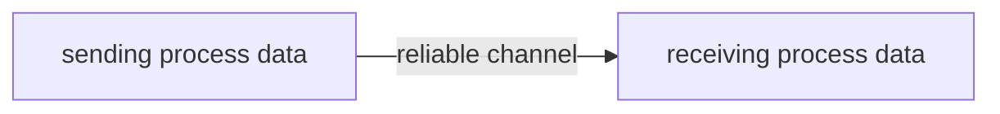
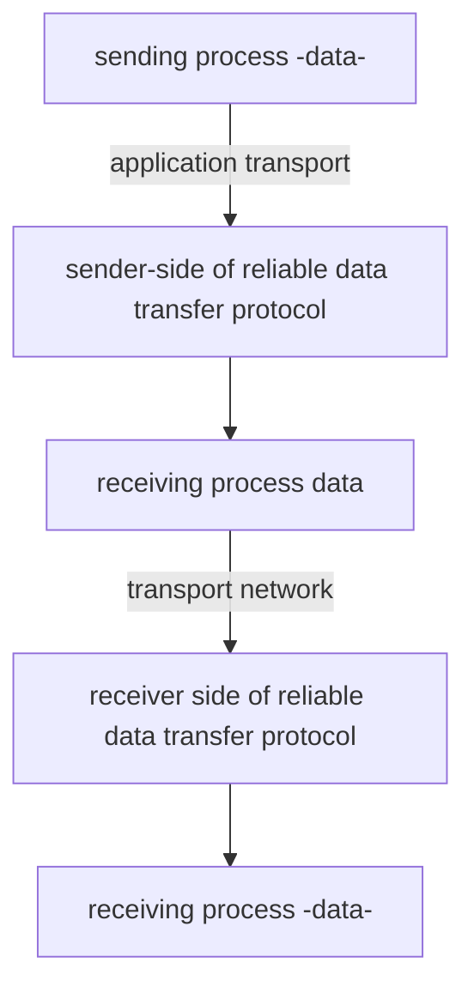
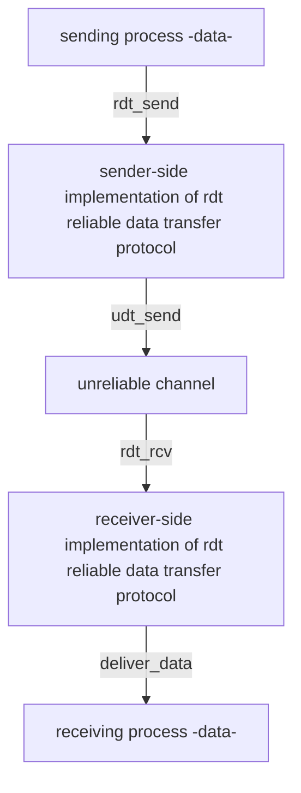
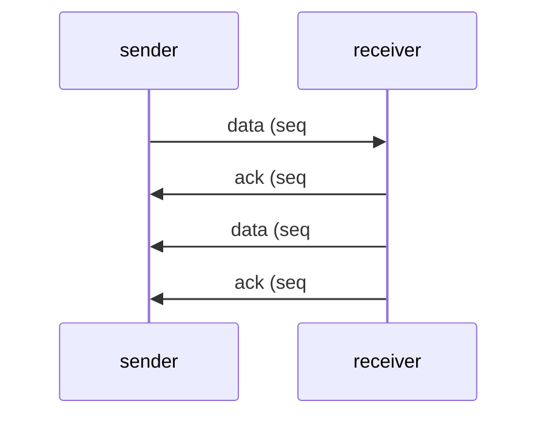
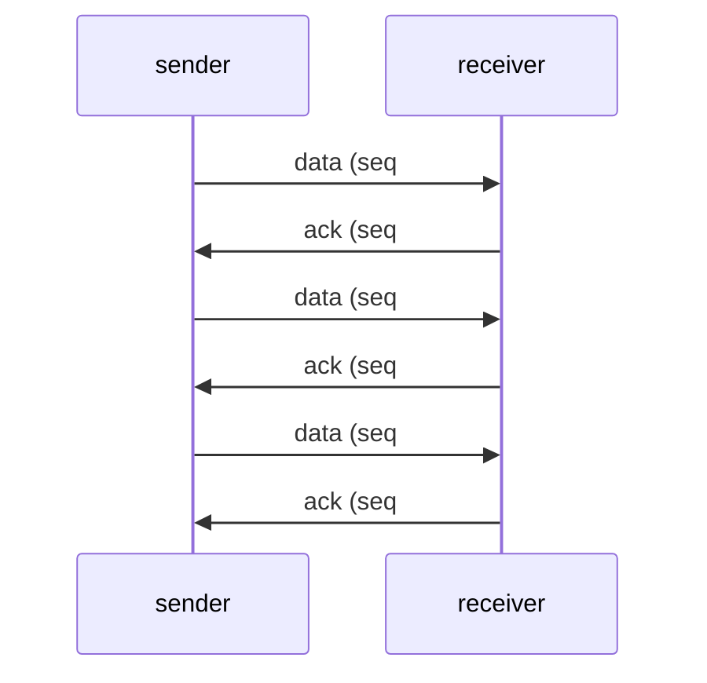
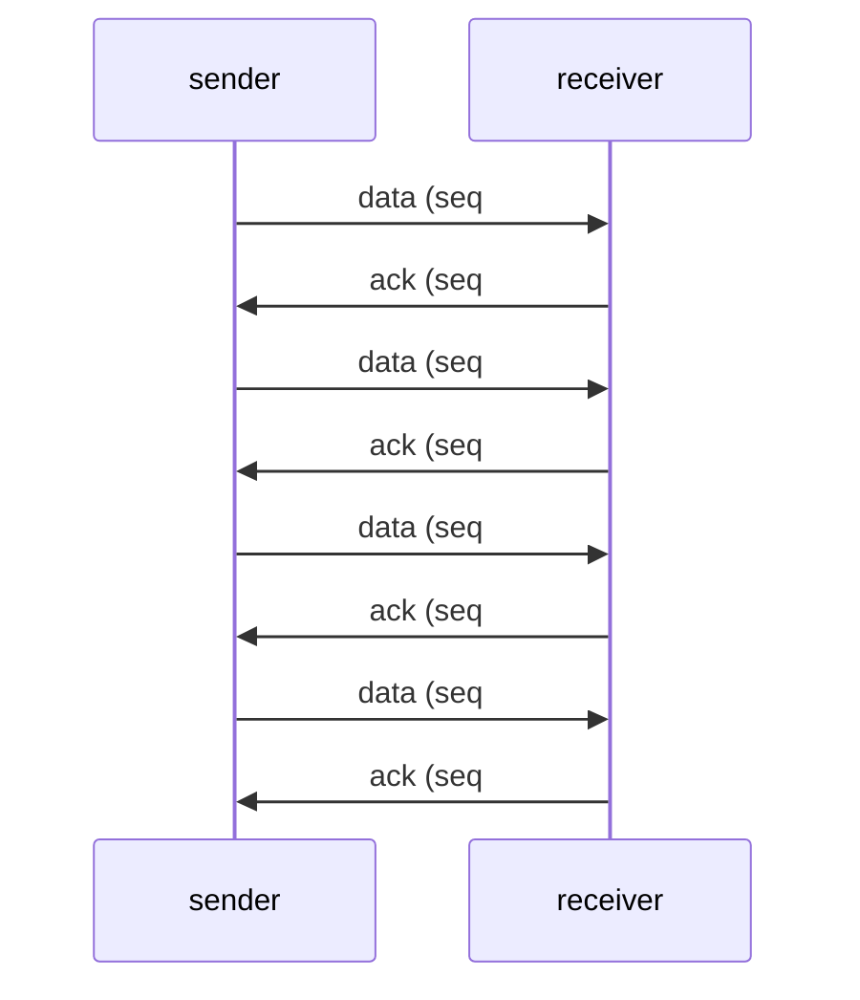
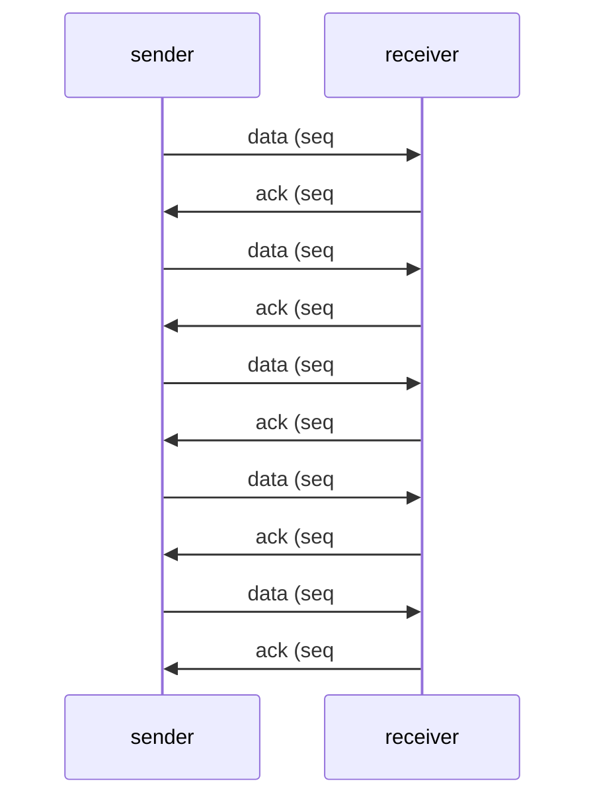

#  computer networks 

##  transport layer

-  how can two entities reliably communicate over a channel in which messages can be corrupted or lost?
-  how can two distributed entities synchronize and share state?
-  how can a collection of different entities adjust their communication rates to prevent network congestion and resource exhaustion?
-  the two main transport protocols are udp and tcp

###  overview

-  understand principles behind transport layer services
    +  multiplexing and de-multiplexing
    +  reliable data transfer
    +  flow control
    +  congestion control
-  learn about internet transport layer protocols
    +  udp:  connection-less transport
    +  tcp:  connection-oriented reliable transport
    +  tcp congestion control

###  transport services and protocols

-  provide logical communication between application processes running on different hosts
-  transport protocols actions in end systems
    +  sender:  breaks application messages into segments and passes the segments to the network layer
    +  receiver:  reassembles segments into messages and passes the messages to the application layer
-  two transport protocols available to internet applications
    +  udp user datagram protocol
    +  tcp transmission control protocol

###  transport vs. network layer services and protocols

-  **transport layer**:  communication between processes
    +  relies on, enhances, network layer services
-  **network layer**:  communication between hosts

###  transport layer actions

**sender**
-  is passed an application layer message
-  determines segment header fields values
-  creates udp segment
-  passes segment to ip

**receiver**
-  receives segment from ip
-  checks udp checksum header value
-  extracts application layer message
-  demultiplexes message up to application via socket

###  two principal internet transport protocols

**tcp** transmission control protocol
-  reliable, in order delivery
-  congestion control
-  flow control
-  connection setup

**udp** user datagram protocol
-  unreliable, unordered delivery
-  no frills extension of best effort ip
-  services not available in udp are delay guarantees and bandwidth guarantees

###  multiplexing / de-multiplexing

**multiplexing as sender**
-  handles data from multiple sockets, and add transport header (later used for de-multiplexing)

**de-multiplexing as a receiver**
-  use header info to deliver received segments to correct socket

###  how demultiplexing works

-  host receives ip datagrams
    +  each datagram has source ip address and a destination ip address
    +  each datagram carries one transport layer segment
    +  each segment has source destination port number
-  host uses ip addresses and port numbers to direct segment to appropriate socket

###  connectionless demultiplexing

-  when creating a socket, the application must specify host local port number
    +  `DatagramSocket mysocket1 = new DatagramSocket(12534);`
-  when creating datagram to send into udp socket, must specify
    +  destination ip address
    +  destination port number
-  when receiving host receives udp segment
    +  checks destination port number in segment
    +  directs udp segemnt to socket with that port number
-  ip/udp datagram with the same destination port number, but different source ip address and/or source port numbers will be directed to the same socket at receiving host

###  connection oriented demultiplexing

-  tcp socket identified by 4-tuple
    +  source ip address
    +  source port number
    +  destination ip address
    +  destination port number
-  demux: receiver uses all four values (4-tuple) to direct segment to appropriate socket
-  server may support many simultaneous tcp sockets
    +  each socket identified by its own 4-tuple
    +  each socket associated with a different connecting client

###  summary

-  multiplexing, demultiplexing: based on segment, datagram header field values
-  **udp**:  demultiplexing using destination port number
-  **tcp**:  demultiplexing using 4-tuple:  source and destination ip addresses, and port numbers
-  multiplexing/demultiplexing happen at all layers

###  udp user datagram protocol

-  udp sender/receiver actions
-  udp segment format
-  internet checksum
-  "no frills", bare bones internet transport protocol
-  best effort service, udp segments may be lost or delivered out of order to app
-  connectionless:  no handshaking between udp sender, receiver and each udp segment handled independently of others

**why is there a udp?**
-  no connection established which can add rtt delay
-  simple:  no connection state at sender, receiver
-  small header size
-  no congestion control
    +  udp can blast away as fast as desired
    +  can function in the face of congestion

-  udp uses 
    +  streaming multimedia apps (loss tolerant, rate sensitive)
    +  dns domain name system
    +  snmp simple network management protocol
    +  http/3 hypertext transfer protocol
-  if reliable tranfer needed over udp
    +  add needed reliability at application layer
    +  add congestion control at application layer

###  udp user datagram protocol rfc 768

```
FC 768                                                        J. Postel
                                                                     ISI
                                                          28 August 1980


                         User Datagram Protocol
                         ----------------------

Introduction
------------

This User Datagram  Protocol  (UDP)  is  defined  to  make  available  a
datagram   mode  of  packet-switched   computer   communication  in  the
environment  of  an  interconnected  set  of  computer  networks.   This
protocol  assumes  that the Internet  Protocol  (IP)  [1] is used as the
underlying protocol.

This protocol  provides  a procedure  for application  programs  to send
messages  to other programs  with a minimum  of protocol mechanism.  The
protocol  is transaction oriented, and delivery and duplicate protection
are not guaranteed.  Applications requiring ordered reliable delivery of
streams of data should use the Transmission Control Protocol (TCP) [2].

Format
------


                  0      7 8     15 16    23 24    31
                 +--------+--------+--------+--------+
                 |     Source      |   Destination   |
                 |      Port       |      Port       |
                 +--------+--------+--------+--------+
                 |                 |                 |
                 |     Length      |    Checksum     |
                 +--------+--------+--------+--------+
                 |
                 |          data octets ...
                 +---------------- ...

                      User Datagram Header Format

Fields
------

Source Port is an optional field, when meaningful, it indicates the port
of the sending  process,  and may be assumed  to be the port  to which a
reply should  be addressed  in the absence of any other information.  If
not used, a value of zero is inserted.
```

###  udp transport layer actions

**udp sender actions**
-  is passed an application layer message
-  determines udp segment header field values
-  creates udp segment
-  passes segment to network layer

**udp receiver actions**
-  is passed an application layer message
-  determines udp segment header fields values
-  creates udp segment
-  passes segment to ip

**udp receiver actions**
-  receives segment from ip
-  checks udp checksum header value
-  extracts application layer message
-  demultiplexes message up to application via socket

###  udp segment header

```
0      7 8     15 16    23 24    31
+--------+--------+--------+--------+
|     Source      |   Destination   |
|-----------------+-----------------|
|     Length      |    Checksum     |
+-----------------+-----------------+
|                                   |
|      application data             |
|      (payload)                    |
|                                   |
|                                   |
+-----------------------------------+
```

###  udp checksum

-  the goal is to detect errors (i.e. flipped bits) in transmitted segment

**sender**:
    -  treats content of udp segment including udp header fields and ip addresses as a sequence of 16-bit integers
-  **checksum**:  addition (1's complement sum) of segment content
-  checksum value is put into the udp checksum field

**receiver**:
-  computes the checksum of received segment
-  checks if computed checksum equals checksum field value
    +  not equal - error detected
    +  equal - no error detected, but there could still be errors

###  internet checksum example

example:  add two 16-bit integers

```
    1 1 1 0 0 1 1 0 0 1 1 0 0 1 1 0
    1 1 0 1 0 1 0 1 0 1 0 1 0 1 0 1
+------------------------------------
  1 1 0 1 1 1 0 1 1 1 0 1 1 1 0 1 1 (wrap around)
-------------------------------------
    1 0 1 1 1 0 1 1 1 0 1 1 1 1 0 0 (sum)
    0 1 0 0 0 1 0 0 0 1 0 0 0 0 1 1 (checksum)
```

note:  when adding numbers, a carryout from the most significant bit needs to be added to the result

###  summary of udp

-  no frills protocol
    +  segment may be lost, delivered out of order
    +  best effort service:  send and hope for the best
-  udp has its plusses:
    +  no setup/handshaking needed (no rtt incurred)
    +  can function when network service is compromised
    +  helps with reliability (checksum)
-  build additional functionality on top of udp in application layer

###  principles of reliable data transfer

-  channel model
-  realistic assumptions
-  protocol mechanisms

reliable service abstraction



**reliable service implementation**


-  complexity of reliable data transfer protocol will depend strongly on characteristics of unreliable channel (lose, corrupt, reorder data?
-  sender, receiver do not know the state of each other, e.g. was a message received?
    +  unless communicated via a message



-  **`rdt_send()`**  called from above (e.g. by app) passed data to deliver to receiver upper level
-  **`udt_send()`**  called by `rdt` to transfer packet over unreliable channel to receiver
-  **`rdt_rcv()`**  called when a packet arrives on receiv er side of channel
-  **`deliver_data()`** called by `rdt` to deliver data to upper layer

###  reliable data transfer:  getting started

-  we will incrementally develop sender receiver sides of reliable data transfer protocol (`rdt`)
-  consider only unidirectional data transfer
    +  but control info will flow in both directions
-  use finite state machines (FSM) to specify sender, receiver

-  what do we really mean when we say RDT senders in a given state or a receiver is in a given state?
-  think about a link being transmitting state or in an idle state
-  think about the notion of there being transitions between states
-  transitions are happening because of an event that takes place
-  think about actions that are taken by the system

###  `rdt1.0`:  reliable transfer over a reliable channel

-  underlying channel is perfectly reliable
    +  no bit errors
    +  no loss of packets
-  separate fsms for sender, receiver
    +  sender sends data into underlying channel
    +  receiver reads data from underlying channel


###  `rdt2.0`:  channel with bit errors

-  underlying channel may flip bits in packet
    +  checksum to detect bit errors
-  the question:  how to recover from errors
    +  **acknowledgements (ACKs)**: receiver explicitly tells sender that pkt received OK
    +  **negative acknowledgements (NAKs)**:  receiver explicitly tells sender that pkt had errors
    +  sender retransmits pkt on receipt of NAK

**stop and wait**
-  sender sends one packet, then waits for receiver response

###  `rdt2.0`  fsm specification


the state of receiver (did the receiver get my message correctly?) isn't known to sender unless somehow communicated from receiver to sender.  this is why we need a protocol

###  `rdt2.0` has a fatal flaw

-  what happens if ack / nak corrupted?
    +  sender doesn't know what happened at receiver
    +  can't just retransmit: possible duplicate

**handling duplicates**
-  sender retransmits current pkt if ACK/NAK corrupted
-  sender adds sequence number to each pkt
-  receiver discards (doesn't deliver up) duplicate pkt

**stop and wait**
sender sends one packet, then waits for receiver response

###  `rdt2.1`:  sender, handling garbled ack/naks


###  `rdt2.1`  discussion

**sender**
-  sequence number added to pkt
-  two sequences numbers (0, 1) will suffice
-  must check of received ACK/NAK corrupted
-  twice as many states
    +  state must remember whether expected pkt should have sequence number of 0 or 1

**receiver**
-  must check of received packet is duplicate
    +  state indicates whether 0 or 1 is expected pkt sequence number
-  note: receiver can not know if its last ACK/NAK received okay at sender

###  rdt protocol mechanisms
-  error detection (e.g. checksum)
-  acks, naks
-  retransmission
-  sequence numbers (duplicate detection)

###  `rdt2.2`:  a nak free protocol

-  same functionality as `rdt2.1`, using acks only
-  instead of nak, receiver sends ack for last psk received ok
    +  receiver must explicitly include seq # of pkt being acked
-  duplicate ack at sender results in same action as nak:  retransmit last pkt

###  `rdt` protocol mechanisms

-  error detection (e.g. checksum)
-  acks, naks
-  retransmission
-  sequence numbers (duplicate detection)

###  rdt3.0:  channels with errors and loss

**new channel assumption**:  underlying channel can also lose packets (data, acks)
-  checksum, sequence #s, acks, retransmissions will be of help but not quite enough

**approach**:  sender waits for a reasonable amount of time for ack
-  retransmits if no acknowledged received in this time
-  if pkt (or ack) just delayed (not lost):
    +  retransmission will be duplicated, but the sequence numbers already handles this
    +  receiver must specify sequence number of packet being acknowledged
-  use countdown timer to interrupt after reasonable amount of time


###  performance of rdt3.0 stop and wait

-  $U_{\text{sender}}: \text{utilization}$ -  fraction of time sender busy sending
-  example:  1 gbps link, 15 ms propagation delay, 8000 bit packet
    +  time to transmit packet into channel
    +  $D_{\text{trans}} = \frac{L}{R} = \frac{8000 \text{bits}}{10^{9} \text{bits/sec}} = 8 \text{ microsecs}$

###  rdt3.0:  stop and wait operation

###  rdt3.0:  pipelined protocols operation

**pipelining**:  sender allows multiple, in-flight, yet to be acknowledged packets
-  range of sequence numbers must be increased
-  buffering at sender and or receiver

###  pipelining:  increased utilization

$$
U_{\text{sender}} = \frac{L}{RTT + \frac{L}{R}}
$$

###  go back n sender

-  sender: window of up to n consecutive transmitted but unacknowledged packets
    +  k-bit sequence number in pkt header
-  cumulative ack:  ack(n): acks all packets up to, including sequence # n
    +  on receiving ack(n): move window forward to begin at n + 1
-  timer for older in flight packet
-  timeout(n):  retransmit packet n and all higher sequence # packets in window

###  go back n receiver

-  acknowledgement only:  always send ack for correctly received packet so far, with highest in order sequence number
    +  may generate duplicate acks
    +  need only remember `rcv_base`
-  on receipt of out of order packet
    +  can discard (don't buffer) or buffer: an implementation decision
    +  re-ack pkt with highest in order sequence number

###  go back n in action

###  selective repeat:  the approach

-  pipelining:  multiple packets in flight
-  receiver individually acknowledges all correctly received packets
    +  buffers packets as needed for in-order delivery to upper layer
-  sender
    +  maintains (conceptually) a timer for each unacknowledged pkt
    +  timeout:  retransmits single unacknowledged packet associated with timeout
    +  maintains (conceptually) a window over n consecutive sequence number
    +  limits pipelined, in flight packets to be within this window

###  selective repeat:  sender, receiver windows

**sender**
-  data from above: if next available seq # in window, send packet
-  timeout(n):  resend packet n, restart timer
-  ack(n) in [sendbase, sendbase + n - 1]:  mark packet n as received, if n smallest unacknowledged packet, advance window base to next unacknowledged seq #

**receiver**
-  packet n in [rcvbase, rcvbase + n - 1]
    +  send ack(n)
    +  out of order: buffer
    +  in order: deliver (also deliver buffered, in order packets) advance window to next not yet received packet
-  packet n in [rcvbase - n, rcvbase - 1]
    +  send ack(n)
-  otherwise
    + ignore

###  selective repeat in action

###  rdt conclusion

-  we saw the use of a common set of techniques, acknowledgements, checksums, and sequence numbers, timeout and retransmit mechanisms
-  primarily in the context of the transport layer but happens at all the layer
-  this is a top 5 networking problem


###  tcp:  overview

-  point to point:  one sender, one receiver
-  reliable, in order byte stream:  no message boundaries
-  full duplex data:  bidirectional data flow in same connection, mss: maximum segment size
-  cumulative acks
-  pipelining:  tcp congestion and flow control set window size
-  connection oriented:  handshaking (exchange of control messages) initializes sender, receiver state before data exchange
-  flow controlled:  sender will not overwhelm receiver

###  tcp segment structure

```
0             7   8            15   16           23   24           31
+---------------+-----------------+-----------------+---------------+
| source port #                   | destination port #              |
+---------------+-----------------+-----------------+---------------+
| sequence number                                                   |
+---------------+-----------------+-----------------+---------------+
| acknowledgment number                                             |
+---------------+-----------------+-----------------+---------------+
| header length |c|e|u|a|p|r|s| f | receive window                  |
+---------------+-----------------+-----------------+---------------+
| checksum                        | urgent pointer                  |
+---------------+-----------------+-----------------+---------------+
| options (variable length)                                         |
+---------------+-----------------+-----------------+---------------+
| application data (variable length)                                |
| ...                                                               |
| ...                                                               |
| ...                                                               |
+---------------+-----------------+-----------------+---------------+
```

###  tcp sequence numbers, acks

-  sequence numbers:  byte stream number of first byte in segment data
-  acknowledgements:  sequence # of next byte expeected from other side, cumulative ack

**question**:  how receiver handles out of order segments?

**answer**:  tcp specification doesn't say up to implementor

**simple telnet scenario**



###  tcp round trip time, timeout

**question**:  how to set tcp timeout value?

**answer**:  longer than an rtt, but rtt varies.  
-  too short:  premature timeout, unnecessary retransmissions
-  too long:  slow reaction to segment loss

**question**:  how to estimate rtt?
-  `SampleRTT`:  measured time from segment transmission until ack receipt, ignore retransmissions
-  `SampleRTT`:  will vary, want estimated rtt to be smoother.  average several recent measurements, but just current `SampleRTT`

$$
EstimatedRTT = (1 - \alpha) \cdot \text{EstimatedRTT} + \alpha \cdot \text{SampleRTT}
$$

-  exponential weighted moving average (ewma)
-  influence of past sample decreases exponentially fast
-  typical value of $\alpha = 0.125$

-  timeout interval:  `EstimatedRTT` plus "safety margin"
-  large variation in `EstimatedRTT`:  want a larger safety margin

$$
\text{TimeoutInterval} = \text{EstimatedRTT} + 4 \cdot \text{DevRTT}
$$

-  `DevRTT`:  EWMA of `SampleRTT` deviation from `EstimatedRTT`

$$
\text{DevRTT} = (1 - \beta) \cdot \text{DevRTT} + \beta \cdot |\text{SampleRTT} - \text{EstimatedRTT}|
$$

-  $\beta = 0.25$

###  tcp sender

**event: data received from application**
-  create segment with sequence number
-  sequence number is byte stream number of first data byte in segment
-  ...

###  tcp receiver: ack generation

###  tcp:  retransmission scenarios



**lost ack scenario**


**premature timeout scenario**



**cumulative ack overs for earlier lost ack**



###  tcp fast retransmit

**tcp fast retransmit**
-  if sender receives 3 addiyional acks for the same data (riple duplicate acks), resend unacked segment with smallest sequence number
-  likely that unacked segment lost, so don't wait for timeout

###  tcp flow control

**receiver protocol stack**

```
+-----------------------------------+
| application process               | <- application removing data from tcp socket buffer
|                                   |
+------------|         |------------+
|            | socket  |            |
+------------v         v------------+
|    tcp socket receiver buffers    |
+-----------------------------------+
|  tcp code                         |
+-----------------------------------+
|  ip code                          | <- network layer delivering ip datagram
|                                   |    payload into tcp socket buffers
+-----------------------------------+
```

**question**:  what happens if network layer delivers data faster than application layer removes data from socket buffer?

**answer**:  flow control -  receiver controls sender, so sender won't overflow receiver's buffer by transmitting too much, too fast

-  tcp receiver advertises free buffer space in `rwnd` field in the tcp header
-  `rcvbuffer` size set 

###  tcp connection managemet

**tcp is connection oriented**
-  what does it mean when the sender and receiver have a lot of shared states?
-  how does it establish the shared state?
-  how does it teardown a connection when a communication is done?

**before exchanging data, sender/receiver handshake**
-  


###  interactive problem

**computing tcp's rtt and timeout values**

**question**:  suppose that tcp's current estimated values for the round trip time (estimatedRTT) and deviation in the RTT (DevRTT) are 400 msec and 39 msec, respectively.  supposed that the next three measured values of the rtt are 390 msec, 400 msec, and 230 msec.

compute tcp's new value of devrtt, estimatedrtt, and the tcp timeout value after each of these three measured rtt values is obtained.  use the values of $\alpha = 0.125$ and $\beta = 0.25$.  round your answers to two decimal places after leading zeros.

1.  what is the estimated rtt after the first rtt?

estimatedrtt = (1 - alpha


