#  the network layer:  data plane

##  introduction

in this section will see how the network layer can provide its host-to-host communication service.  there is a piece of the network layer in each and every host and router in the network, because of this the network layer protocols are among the most challenging in the protocol stack.  the network layer is decomposed into two parts, the data plane and the control plane.  we will first cover the data plane functions of the network layer - **the per-router functions in the network layer that determine how a datagram arriving on one of a router's input links is forwarded to one of that router's output links**.  we will cover **traditional ip forwarding** -  where forwarding is based on a datagrams destination address and **generalized forwarding** -  where forwarding and other functions may be performed using values in several different fields in the datagram's header.  we will study ipv4 and ipv6 protocols and addressing in detail.  

in contrast to the data plane, the control plane is the network wide **logic that controls how a datagram is routed among routers along an end-to-end path from the source host to the destination host**.  the control plane has routing algorithms and routing protocols such a ospf and bgp which are implemented within a router.  software defined networking sdn explicitly separates the data plane and control plane by implementing these control plane functions as a separate service in a remote controller.

##  overview of network layer

<p align="center">
    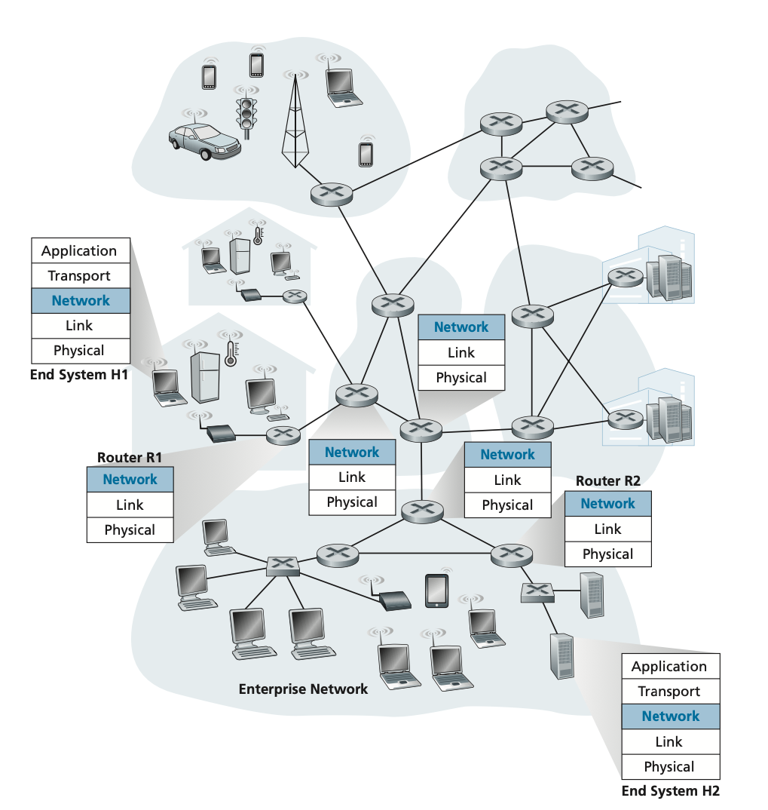
</p>

this figure shows two hosts h1 and h2 and several routers on the path between h1 and h2.  the role of the network layer in these hosts and in the intervening router is to send information from h1 to h2.  the network layer in h1 takes segments from the transport layer in h1, encapsulates each segment into a datagram and then sends the datagram to its nearby router, r1.  at the receiving host h2, the network layer receives teh datagrams from its nearby router r2 and extracts the transport layer segments and delivers the segments up to the transport layer at h2.  

the primary data plane role of each router is to forward datagrams from its input links to its output links.

the primary role of the network control plane is to coordinate these local, per router forwarding actions so that datagrams are transferred end-to-end along paths of routers between source and destination hosts.

###  forwarding and routing:  the data and control plane

the primary role of the network layer is to move packets from the sending host to the receiving hosts, this is done with two different network layer functions forwarding and routing.

-  **forwarding**:  when a packet arrives at a router's input link, the router must move the packet to the appropriate output link.  for example, a packet arriving from host h1 to router r1 must be forwarded to router r2 or the next router on a path to h2.  

-  **routing**:  the network layer must determine the route or path taken by packets as they flow from sender to receiver.  routing algorithms are used to determine the path that packets will take from source to destination, for example the path from h1 to h2.  routing is implemented in the control plane of the network layer.

**forwarding** refers to the router local action of transferring a packet from an input link interface to the appropriate output link interface.  **routing** refers to the network-wide process that determines the end-to-end paths that packets take from source to destination.  forwarding happens at the hardware level while routing happens at the software level.  a key element in every network router is its **forwarding table**.  a router forwards a packet by examining the value of one or more fields in the arriving packets header, and then using these header values to index into its forwarding table.  the value stored in the forwarding table entry for those values indicates the outgoing link interface at that router to which that packet is to be forwarded.  

in the figure below a packet with header field value of 0110 arrives to a router.  the router indexes into its forwarding table and determines that the output link interface for this packet is interface 2.  the router then internally forwards the packet to interface 2.  

<p align="center">
    
</p>

###  control plane:  the traditional approach

in the control plane the routing algorithm determines the contents of the routers forwarding tables.  a routing algorithm runs in each and every router and both forwarding and routing functions are contained within a router.  the routing algorithm computes the values for its forwarding table between one router and another.  this communication is performed by exchanging routing messages containing routing information according to a routing protocol.  

###  control plane:  the software defined networking (sdn) approach

here is an alternative approach in which a physically separate remote controller computes and distributes the forwarding tables to be used by each and every router.  as opposed to each router having a routing component that communicates with the routing component of other routers.  

<p align="center">
    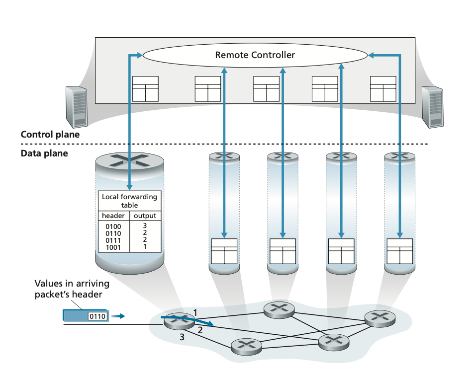
</p>

a remote controller determines and distributes values in forwarding tables.  the control plane routing functionality is separated from the physical router - the routing device performs forwarding only, while the remote controller computes and distributes forwarding tables.  the remote controller might be implemented in a data center and managed by an isp or third party.  routers and remote controllers communicate by exchanging messages containing forwarding tables and other pieces of routing information.  the controller that computes forwarding tables and interacts with routers is implemented by software and is therefore software defined networking.  

##  network service model

when the transport layer at a sending host transmits a packet into the network meaning that it passes it down to the network layer at the sending host, can the transport layer rely on the network layer to deliver the packet to the destination?  when multiple packets are sent, will they be delivered to the transport layer in the receiving host in the order in which they were sent?  will the amount of time between the sending of two sequential packet transmission be the same as the amount of time between their reception?  these questions are addressed by the network service model.  the network service model defines the characteristics of end-to-end delivery of packets between sending and receiving hosts.

**services provided by the network layer**

-  **guaranteed delivery**:  this service guarantees that a packet sent by a source host will eventually arrive at the destination host.
-  **guaranteed deliver with bounded delay**:  this service guarantees delivery within a specified host to host delay bound.
-  **in order packet delivery**:  this service guarantees that packets arrive at the destination in the order that they were sent.
-  **guaranteed minimal bandwidth**:  this service emulates the behavior of a transmission link of a specified bit rate between sending and receiving hosts.
-  **security**:  this service encrypts all datagrams at the source and decrypts them at the destination, thereby providing confidentiality to all transport layer segments.

the internets network layer provides a single service, known as best effort service.  

in the next section we will cover the data plane component of the network layer.  
-  the internal hardware operations of a router, **including input and output packet processing**, the **router's internal switching mechanism**, and **packet queuing and scheduling**.  
-  **traditional ip forwarding**, in which packets are forwarded to output ports based on their destination ip addresses 
-  **ip addressing**, specifically **ipv4** and **ipv6**.  
-  **generalized forwarding** where packets may be forwarded to output ports based on a larger number of header values.  packets may be blocked or duplicated at the router or may have certain header field values rewritten all under software control.
-  **middleboxes** that can perform functions in addition to forwarding

**packet switch** is to mean a general packet switching device that transfers a packet from input link interface to an output link interface according to values in a packet's header fields.  **link-layer switches** are a type of packet switch that base their forwarding decisions on values in the fields of the link layer frame; switches thus referred to as link layer devices.  other packet switches are called **routers**, which base their forwarding decisions on header field values in the network layer datagram.  routers are network layer devices.

##  what's inside a router

we will focus on the forwarding function - the actual transfer of packets from a router's incoming links to the appropriate outgoing links at that router.  the figure below shows a router's architecture.

<p align="center">
    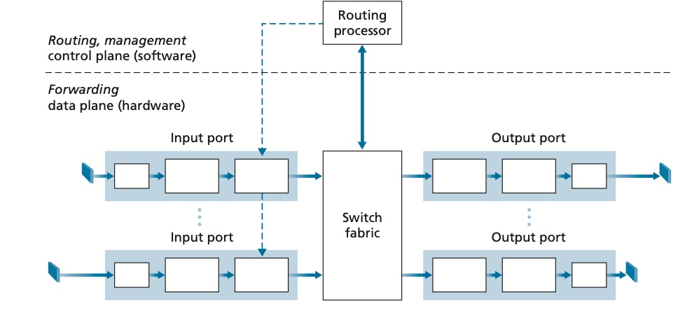
</p>

-  **input ports** perform several functions.  it performs the physical layer function of **terminating an incoming physical link at a router**, shown in the left most box of the input port.  an input port also performs **link layer functions needed to interoperate with the link layer at the other side of the incoming link**; this is represented in the middle boxes of the input and output ports.  **a lookup function is also performed at the input port**; this will occur in the right most box of the input port.  it is here that the forwarding table is consulted to determine the router output port to which an arriving packet will be forwarded via the switching fabric.  control packets (packets carrying routing protocol information) are forwarded from an input port to the router processor.  the number of ports supported by a router can range from some to hundreds.  
-  **switching fabric**:  the switching fabric connects the router's input ports to its output ports.  this switching fabric is completely contained within the router - a network inside of a network router.
-  **output ports** stores packets received from the switching fabric and transmits these packets on the outgoing link by performing the necessary link layer and physical layer functions.  
-  **routing processor** performs control plane functions.  in traditional routers - it executes the routing protocols, maintains routing tables and attached link state information, and computes the forwarding table for the router.  in sdn routers - the routing processor is responsible for communicating with the remote controller in order to receive forwarding table entries computed by the remote controller and install these entries in the router's input ports.  the routing processor also performs the network management functions that we will see later on.

###  input port processing and destination based forwarding

the input port's line termination function and link layer processing implement the physical and link layers for that individual input link.  the lookup performed in the input port is central to the router's operation -  the router uses the forwarding table to look up the output port to which an arriving packet will be forwarded via the switching fabric.  the forwarding table is either computed and updated by the routing processor or received from a remote sdn controller.  the forwarding table is copied from the routing processor to the line cards over a separate bus indicated by the dashed line from the routing processor to the input line card.  

a shadow copy at each line card, forwarding decision can be made locally at each input port without invoking the centralized routing processor on a per packet basis and thus avoiding a centralized processing bottleneck.  

<p align="center">
    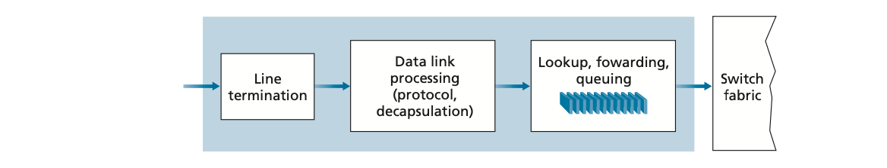
</p>

in this case of 32-bit ip addresses, a brute force implementation of the forwarding table would have one entry for every possible destination address.  since there are more than 4 billion possible address, this option is out of the question.

**lets suppose that our router has four links number 0 through 3 and that packets are to be forwarded to the link interfaces as follows:**

**link interfaces**

| destination address range                | link interface |
|:-----------------------------------------|:--------------:|
|`11001000 00010111 00010000 0000000`      | 0              |
| through                                  | 0              |
|    `11001000 00010111 00010111 11111111` | 0              |
|`11001000 00010111 00011000 00000000`     | 1              |
| through                                  | 1              |
|    `11001000 00010111 00011000 11111111` | 1              |
|`11001000 00010111 00011001 00000000`     | 2              |
|  through                                 | 2              |
|  `11001000 00010111 00011111 11111111`   | 2              |
| `otherwise`                              | 3              |

**forwarding table**

| prefix                      | link interface |
|:----------------------------|:--------------:|
| `11001000 00010111 00010`   | 0              |
| `11001000 00010111 00011000`| 1              |
| `11001000 00010111 00011`   | 2              |
| `otherwise`                 | 3              |

the router matches a prefix of the packet's destination address with the entries in the table; if there's a match, the router forwards the packet to a link associated with the match.  packet with destination address `11001000 00010111 00010110 10100001` will go to link interface 0.  however, when there are multiple matches, the router uses the **longest prefix matching rule**; that is, it finds the longest matching entry in the table and forwards the packet to the link interface associated with the longest prefix match.    

once a packet's output port has been determined via the lookup, the packet can be sent into the switching fabric.  lookup is the most important action in input port processing, but many other actions must be taken 

1.  physical and link layer processing must occur
2.  the packet's version number, checksum, and time-to-live fields must be checked and the latter two fields rewritten
3.  counters used for network management such as the number of ip datagrams received must be updated.

the input port steps of looking up a destination ip address and then sending the packet into the switching fabric to the specified output port is a specific case of a more general match plus action abstraction that is performed in many networked devices, not just routers.  in link layer switches, link layer destination addresses are looked up and several actions may be taken in addition to sending the frame into the switching fabric towards the output port.  

##  switching

the switching fabric is at the heart of a router and through this fabric is where packets are actually switched (forwarded) from an input port to an output port.  switching can be accomplished in a number of ways

-  **switching via memory**:  where switching between input and output ports are done under direct control of the cpu (routing processor).  an input port with an arriving packet first signaled the routing processor via an interrupt.  the packet was then copied from the input port into processor memory.  the routing processor then extracted the destination address from the header, looked up the appropriate output port in the forwarding table and copied the packet to the output ports buffers.  in this scenario two packets cannot be forwarded at the same time.

-  **switching via bus** -  input ports transfer a packet directly to the output port over a shared bus, without intervention by the routing processor.  

-  **switching via an interconnection network** -  one way to overcome the bandwidth limitation of a single, shared bus is to use a sophisticated interconnection network, such as those that have been used in the past to interconnect processor in a multiprocessor computer architecture.  a crossbar switch is non blocking a packet being forwarded to an output port will not be blocked from reaching that output port as long as no other packet from two different input ports are destined to that same output port, then one will have to wait at the input, since only one packet can be sent over any given bus at a time.

<p align="center">
    
</p>

###  output port processing

output port processing shown below takes packets that have been stored in the output port's memory and transmits them over the output link.  this includes selecting (i.e. scheduling) and de-queuing packets for transmission, and performing the needed link-layer and physical-layer transmission functions.

<p align="center">
    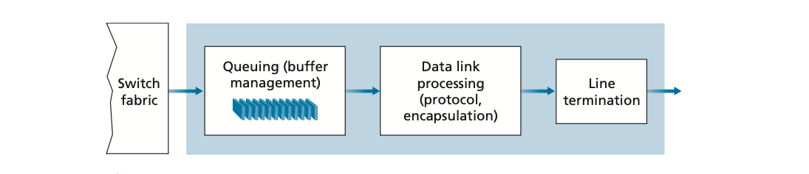
</p>

###  where does queuing occur?

packet queues may form at both the input ports and the output ports.  the location and extent of queuing will depend on the traffic load, the relative speed of the switching fabric, and the line speed.  queues can grow large, and the router's memory can eventually be exhausted and packet loss will occur when no memory is available to store arriving packets.  at these queues within a router where packets are actually dropped and lost.

suppose that input and output transmission rates all have an identical transmission rate of $R_{\text{line}}$ packets per second, and that there are $N$ input ports and $N$ output ports.  assume all packets have the same fixed length and that packets arrive to input ports in a synchronous manner.  define the switching fabric transfer rate $R_{\text{switch}}$ as the rate at which packets can be moved from input port to output port.  if $R_{\text{switch}}$ is $N$ times faster than $R_{\text{line}}$, then only negligible queuing will occur at the input ports.  This is because even the worst case, where all $N$ input lines are receiving packets, and all packets are to be forwarded to the same output port, each batch of $N$ packets (one packet per input port) can be cleared through the switch fabric before the next batch arrives.

###  input queuing

but what happens if the switch fabric is not fast enough to transfer all arriving packets through the fabric without delay?  in this case packet queuing can also occur at the input ports, as packets must join input port queues to wait their turn to be transferred through the switching fabric to the output port.  

to illustrate an important consequence of this queuing, consider a crossbar switching fabric and support that,

1.  all link speeds are identical
2.  that one packet can be transferred from any one input port to a given output port in the same amount of time it takes for a packet to be received on an input link
3.  packets are moved from a given input queue to their desired output queue in an first come first serve manner.

multiple packets can be transferred in parallel, as long as their output ports are different.  however, if two packets at the front of two input queues are destined for the same output queue, then one of the packets will be blocked and must wait at the input queue - the switching fabric can transfer only one packet to a given output port at a time.

the figure below shows an example in which two packets at the front of their input queues are destined for the same upper-right output port.  suppose that the switch fabric chooses to the packet from the front of the upper-left queue.  in this case the darkly shaded packet in the lower left queue must wait.  but not only must this darkly shaded packet wait, so too must the lightly shaded packet that is queued behind that packet in the lower left queue, even though there is no contention for the middle right output port.  this phenomenon is known as **head-of-the-line (HOL) blocking** in an input queued switch - a queued packet in an input queue must wait for transfer through the fabric because it is blocked by another packet at the head of the line.

<p align="center">
    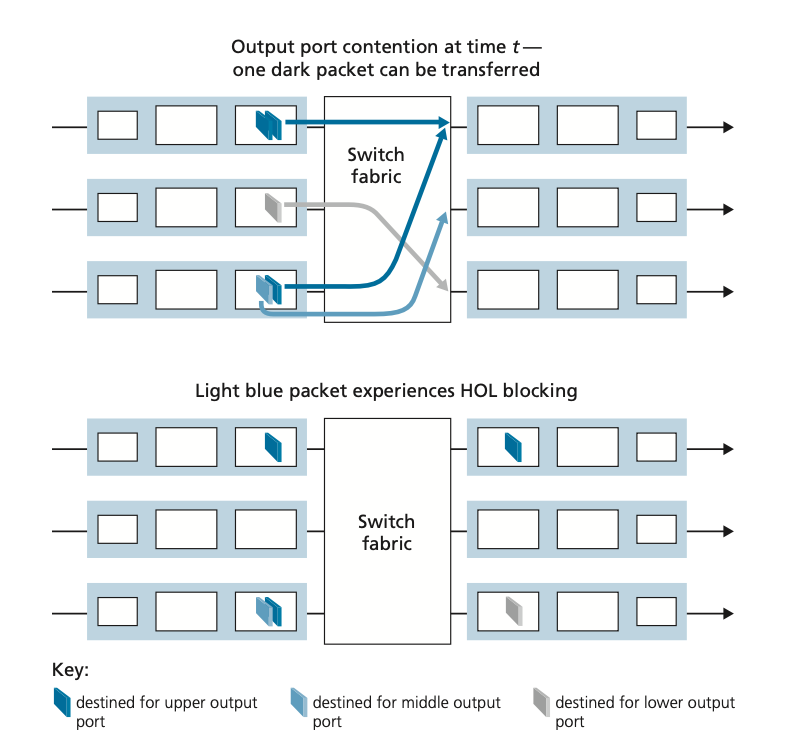
</p>

###  output queuing

packet queues can form at the output ports even when the switching fabric is $N$ times faster than the port line speeds.  eventually, the number of queued packets can grow large enough to exhaust available memory at the output port.  when there is not enough memory to buffer an incoming packet, a decision must be made to either drop the arriving packet known as **drop-tail** or remove one or more already queued packets to make room for the newly arrived packet.  in some cases it may be advantageous to drop a packet before the buffer is full in order to provide a congestion signal to the sender.  this marking could be done using the explicit congestion notification bits.  a number of proactive packet dropping and marking policies are known as **active queue management** aqm algorithms.  one algorithm is known as **random early detection** red algorithm.

output port queuing is shown in the figure below.  at time t, a packet has arrived at each of the incoming input ports, each destined for the uppermost outgoing port.  assuming identical line speeds and a switch operating at three times the line speed, one time unit later, all three original packets have been transferred to the outgoing port and are queued awaiting transmission.  in the next time unit one of these three packets will have been transmitted over the outgoing link.  in the example, two new packets have arrived at the incoming side of the switch; one of these packets is destined for this uppermost output port.  a consequence of such queuing is that a **packet scheduler** at the output port must choose one packet, among those queued for transmission.

<p align="center">
    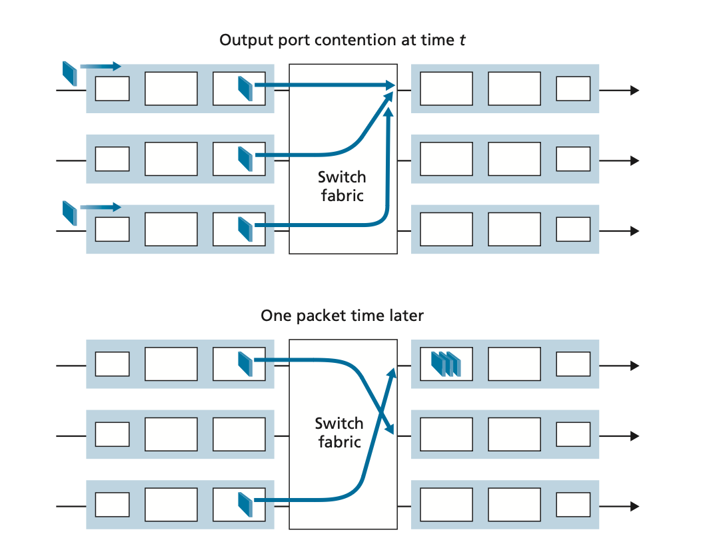
</p>

###  how much buffering is enough?

we have shown how a packet queue forms when bursts of packets arrive at a router's input or output port, and the packet arrival rate temporarily exceeds the rate at which packets can be forwarded.  the long the amount of time that this mismatch persists, the longer the queue will grow, until eventually a port's buffers become full and packets are dropped.  therefore the question of **how much buffering should be provisioned at a port have** is the question of concern.

the amount of buffering **B** should equal to an average round trip time **RTT**, say 250 msec times the link capacity **C**.  thus, a 10-gbps link with an rtt of 250 msec would need an amount of buffering equal to **B = RTT * C** = 2.5 gbits of buffers.  

when a large number of independent tcp flows **N** pass through a link, the amount of buffering needed is **B = RTT * C / √N**.  in core networks where a large number of tcp flows typically pass through large backbone router links, the value of **N** can be large, with the decrease in needed buffer size becoming quite significant.  

it seems that larger buffers would allow a router to absorb larger fluctuations in the packet arrival rate, thereby decreasing the router's packet loss rate.  however large buffers also mean potentially longer queuing delays.  increased rtts also make tcp senders less responsive and slower to respond to incipient congestion and or packet loss.  therefore buffering can be used to absorb short term statistical fluctuations in traffic but can also lead to increased delay and the attendant concerns.  this is all with the assumption that independent senders are competing for bandwidth abd buffers at a congestion link.

the figure below shows a home router sending tcp segments to a remote game server.  suppose that it take 20 ms to transmit a packet, that there are negligible queuing delays elsewhere on the path to the server, and that the rtt is 200 ms.  suppose that at time t = 0, a burst of 25 packets arrives to the queue.  one of these queued packets is then transmitted once every 20 ms, so that at t = 200 msec, the first ack arrives, just as the 21st packet is being transmitted.  this ack arrival causes the tcp sender to send another packet which is queued at the outgoing link of the home router. at t = 220, the next ack arrives and another tcp segment is released by the gamer and is queued, as the 22nd packet is being transmitted and so on.  the end to end pip is full (delivering packets to the destination at a path bottleneck rate of one packet every 20 ms), but the amount of queuing delay is constant and persistent.  this is known as **bufferbloat** which illustrates that not only is throughput important, but also minimal delay is important as well.

<p align="center">
    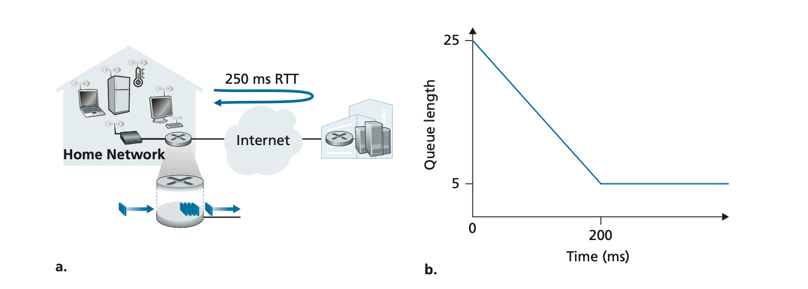
</p>

##  packet scheduling

packet scheduling concerns itself with determining the order in which queued packets are transmitted over an outgoing link.  one disciple is known as fcfs first come first serve and the other is known as round robin where customers for example are divided into classes (as in priority queuing) but each class of customer is given service in return.

###  first in first out 

packets arriving at a link output queue wait for transmission if the link is currently busy transmitting another packet.  if there is not sufficient buffering space to hold the arriving packet, the queue's packet discarding policy then determines whether the packet will be dropped or whether other packets will be removed from the queue to make space for the arriving packet.  when a packet is completely transmitted over the outgoing link it is removed from the queue.

the first come first serve scheduling disciple selects packets for link transmission in the same order in which they arrived at the output link queue.  

<p align="center">
    
</p>

figure below shown the fifo queue in operation.  packet arrivals are indicated by numbered arrows above the upper time line, with the number indicating the order in which the packet arrived.  individual packet departures are shown below the lower timeline.  the time that a packet spends in service (being transmitted) is indicated by the shaded rectangle between the two timelines.  in this example, lets assume that each packet take three units of time to be transmitted.  under the fifo disciple packets leave in the same order in which they arrive.  

<p align="center">
    
</p>

###  priority queuing

under priority queuing packets arriving at the output link are classified into priority classes upon arrival at the queue.  in practice a network operator may configure a queue so that packets carrying network management information (ex. as indicated by the source or destination tcp/udp port numbers) receive priority over user traffic; additionally real time over voice over ip packets might receive priority over non real time traffic such as email packets.  each priority class typically has its own queue.  

<p align="center">
    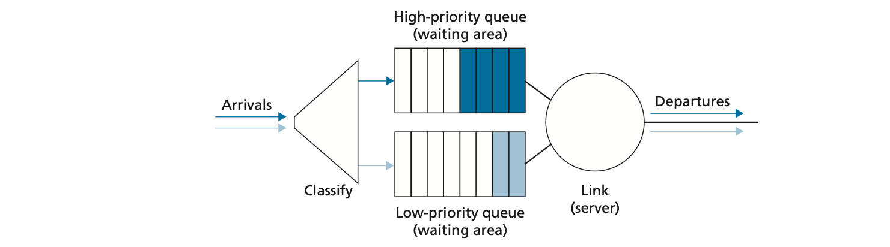
</p>

when choosing a packet to transmit, the priority queuing discipline will transmit a packet from the highest priority class that has a nonempty queue.  the choice among packets in the same priority class is done in a fifo manner.   the figure below shows two priority classes.  packets 1, 3, and 4 belong to the high priority class and 2 and 5 are in the low priority class.  under a **non-preemptive priority queuing** discipline, the transmission of a packet is not interrupted once it has begin.  this case shows that packet 4 queues for transmission and begins being transmitted after the transmission of packet 2 is completed.

<p align="center">
    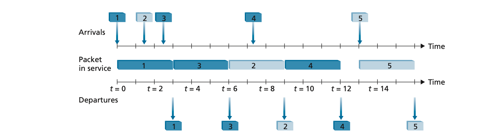
</p>

###  round robin and weighted fair queuing

under the round robin queuing disciple, packets are stored into classes as with priority queuing.  however rather than there being a strict service priority among classes, a round robin scheduler alternates service among classes.  a class 1 packet is transmitted, followed by a class 2 packet, followed by a class 1 packet, followed by a class 2 packet and so on.  a so called **work conserving queuing** discipline will never allow the link to remain in idle whenever there are packets queued for transmission.  a work conserving round robin discipline that looks for a packet of a given class but finds non will immediately check the next class in the round robin sequence.

the figure below illustrates the operation of two class round robin queue.  in this example packets 1, 2, and 4 belong to class 1 and packets 3 and 5 belong to the second class.  packet 1 begins transmission immediately upon arrival at the output queue.  packet 2 and 3 arrive during the transmission of packet 1, the link scheduler looks for a class 2 packet and thus transmits packet 3.  after the transmission of packet 3, the scheduler looks for a class 1 packet and thus transmits packet 2.  after the transmission of packet 2, packet 4 is the only queued packet; and thus transmitted immediately after packet 2.  

<p align="center">
    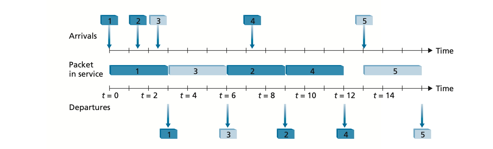
</p>

a generalized form of round robin queuing that has been widely implemented in routers is the so classed **weighted fair queuing discipline** wfq.  here, arriving packets are classified and queued in the appropriate per class waiting area.  as in round robin scheduling, a wfq scheduler will serve classes in a circular manner - first serving class 1, then serving class 2, then serving class 3, and then repeating the service pattern.  wfq is also a work conserving queuing discipline and thus will immediately move on to the next class in the service sequence when it finds an empty class queue.  

wfq differs from round robin in that each class may receive a differential amount of service in any interval of time.  specifically each class $i$ is assigned a weight $w_{i}$.  under wfq, during any interval of time during which there are class $i$ packets to send class $i$ will then be guaranteed to receive a fraction of service equal to $\frac{w_{i}}{\sum{w_{i}}}$, where the sum in the denominator is taken over all classes that also have packets queued for transmissions.  for a link with transmission rate $R$, class $i$ will always achieve a throughput of at least $R \cdot w_{i} / \sum{w_{i}}$.

<p align="center">
    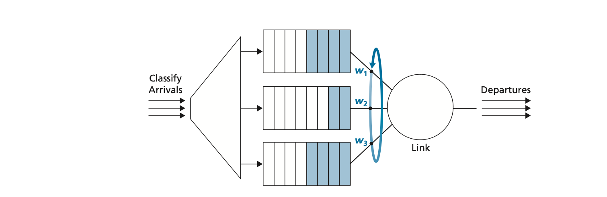
</p>

##  the internet protocol ip: ipv4, addressing, ipv6, and more

this section will focus on key aspects of the network layer on today's internet and the celebrated internet protocol ip.  there are two versions of ip in use today.  ipv4 and ipv6.

###  ipv4 datagram format

recall that the internet's network layer packet is referred to as a datagram.  the datagram plays a central role in the internet.  the ipv4 datagram format is shown in the figure below, the key fields in the ipv4 datagram are as follows.

ipv4 datagram format

```
 <------------------------------------------ 32 bits --------------------------------------------> 

+-------------------------------------------------------------------------------------------------+
| version | header length | type of service     | datagram length (bytes)                         |
|-----------------------------------------------|-------------------------------------------------|
| 16-bit identifier                             | flags | 13 bit fragmentation offset             |
|-----------------------------------------------|-------------------------------------------------|
| time to live | upper layer protocol           | header checksum                                 |
|-----------------------------------------------|-------------------------------------------------|
|                                  32 bit source ip address                                       |
|-------------------------------------------------------------------------------------------------|
|                                  32 bit destination ip address                                  |
|-------------------------------------------------------------------------------------------------|
|                                        options (if any)                                         |
|-------------------------------------------------------------------------------------------------|
|                                        payload data                                             |
+-------------------------------------------------------------------------------------------------+
```

-  **version number** -  these 4 bits specify the ip protocol version of the datagram.  by looking at the version, number the router can determine how to interpret the remainder of the ip datagram.  different versions of ip use different datagram formats.  the datagram format of ipv4 is show above.

-  **header length** -  because an ipv4 datagram can contain a variable number of options these 4 bits are needed to determine where in an ip datagram the payload actually begins.  most ip datagrams do not contain options, so the typical ip datagram has a 20-byte header.

-  **type of service** -  the type of service tos bits were included in the ipv4 header to allow different types of ip datagrams to be distinguished from each other.  for example, it might be useful to distinguish real-time datagram from non-real-time traffic.  the specific level of service to be provided is a policy issued determined and configured by the network administrator for that router.  also two of the tos bits are used for explicit congestion notification.

-  **datagram length** -  this is the total length of the ip datagram header plus data, measured in bytes.  the maximum length of an ip datagram is 65,535 bytes.  the minimum length is 20 bytes.

-  **identifier, flags, fragmentation offset** -  these three fields have to do with so called ip fragmentation, when a large ip datagram is broken into several smaller ip datagrams which are then forwarded independently to the destination, where they are reassembled before their payload data is passed up to the transport layer at the destination host.  

-  **time to live** -  the time to live ttl field is included to ensure that datagrams do not circulate forever in the network.  this field is decremented by one each time the datagram is processed by a router.  if the ttl field reaches 0, a router must drop that datagram.

-  **protocol** -  this field is typically used only when an ip datagram reaches its final destination.  the value of this field indicates the specific transport layer protocol to which the data portion of this ip datagram should be passed.  for example a value of 6 indicates that the data portion is passed to tcp while a value of 17 indicates that the data is passed to udp.  note that the protocol number in the ip datagram has a role that is analogous to the role of the port number field in the transport layer segment.  the protocol number is the glue that binds th network and transport layers together, whereas the port number is the glue that binds the transport and application layers together.  

-  **header checksum** -  the header checksum aids a router in detecting bit errors in a received ip datagram.  a router computes the header checksum for each received ip datagram and detects an error condition if the checksum carried in teh datagram header does not equal the computed checksum.  routers typically discard datagrams for which an error has been detected.  

-  **source and destination ip addresses** -  when a source creates a datagram, it inserts its ip address into the source ip address field and inserts the address of the ultimate destination into the destination ip address field.  often the source host determines the destination address via a dns lookup.  

-  **options** -  the options fields allow an ip header to be extended.  header options were meant to be used rarely - hence the decision to save overhead by not including the information in options fields in every datagram header.  however, mere existence of options does complicate matters - since datagram headers can be of variable length, one cannot determine a priori where the data field will start.  also since some datagrams may require options processing and others may not, the amount of time needed to process an ip datagram at a router can vary greatly.  these considerations become particularly important for ip processing in high performance routers and hosts.  for these reasons and others, ip options were not included in the ipv6 header.

-  **data (payload)** -  in most circumstances, the data field of the ip datagram contains the transport layer segment (tcp or udp) to be delivered to the destination.  however, the data field can carry other types of data such as icmp messages.

###  ipv4 addressing 

prior to speaking about ipv4 addressing we must introduce how hosts and routers are connected to the internet.  a host typically has only a single link into the network; when ip in the host wants to send a datagram, it does so over this link.  the boundary between the host and the physical link is called an **interface**.  now consider a router and its interfaces,  because a router's job is to receive a datagram on one link and forward the datagram on some other link, a router necessarily has two or more links to which it is connected.  the boundary between the router and any one of its links is also called an interface.  a router thus has multiple interfaces, one for each of its links.  because every host and and router is capable of sending and receiving ip datagrams, ip requires each host and router interface to have its own ip address.  thus, an ip address is technically associated with an interface, rather than with the host or router containing that interface.

each ip address is 32 bits long ad there are thus a total of $2^{32}$ possible ip addresses.  these addresses are typically written in so called **dotted decimal notation**, in which each byte of the address is written in its decimal form and is separated by a period from other bytes in the address.  an ip address for example `193.32.216.9`.  the `193` is the decimal equivalent of the first 8 bit of the address; the 32 is the decimal equivalent of the second 8 bits of the address and so on.  therefore the address `193.32.216.9` in binary notation is `11000001 00100000 11011000 00001001`.

each interface on every host and router in the global internet must have an ip address that is globally unique.  these addresses cannot be chosen in a willy nilly manner.  a portion of an interface's ip address will be determined by the subnet to which it is connected.  the figure below provides an example of ip addressing and interfaces.  one router with three interfaces is used to interconnect seven hosts.  the three hosts in the upper left portion and the router interface to which they are connected all have an ip address of the form `223.1.1.xxx`.  that is they all have the same leftmost 24 bits in their ip address.  these four interfaces are also interconnected to each other by a network that contains no routers.  this network could be interconnected by an ethernet lan, in which case the interfaces would be interconnected by an ethernet switch or by a wireless access point.  we will represent this routerless network connecting these hosts as a cloud for now and dive into the internals of such networks later.

<p align="center">
    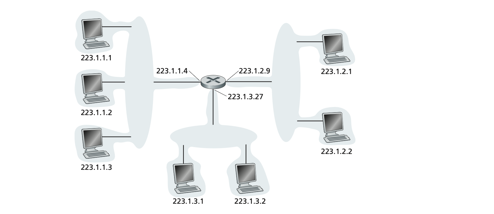
</p>

in ip terms, this network interconnecting three host interfaces and one router interface forms a **subnet**.  a subnet is also called an ip network or simply network in the internet literature.  ip addressing assigns an address to this subnet: `223.1.1.0/24`, where the `/24` notation sometimes known as a **subnet mask**, indicates that the leftmost 24 bits of the 32-bit quantity define the subnet address.  

the ip definition of a subnet is not restricted to ethernet segments that connect multiple hosts to a router interface.  to get some insight here, consider the figure below which shows three routers that are interconnected with each other by point to point links.  each router has three interfaces one for each point to point link and one for the broadcast link that directly connects the router to a pair of hosts.  what subnets are present here?  

<p align="center">
    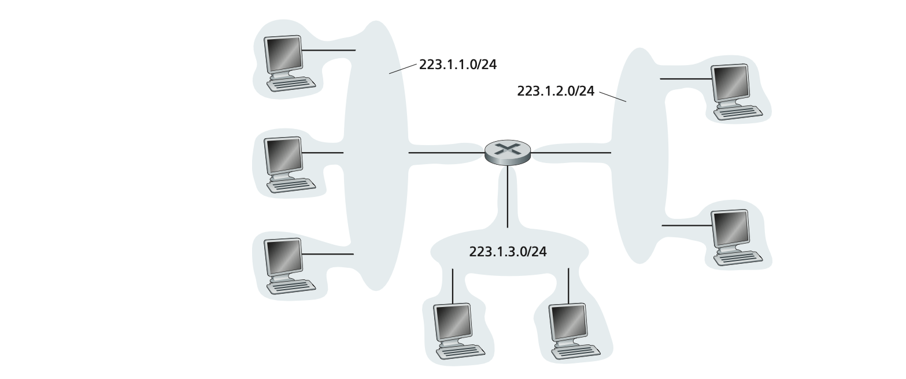
</p>

three subnets `223.1.1.0/24`, `223.1.2.0/24`, and `223.1.3.0/24` are similar to the subnet we encountered from the figure above.  but note that there are three additional subnets in this example as well 

-  subnet `223.1.9.0/24` for the interfaces that connect router r1 and r2
-  subnet `223.1.8.0/24` for the interfaces that connect routers r2 and r3
-  subnet `223.1.7.0/24` for the interfaces that connect routers r3 and r1

<p align="center">
    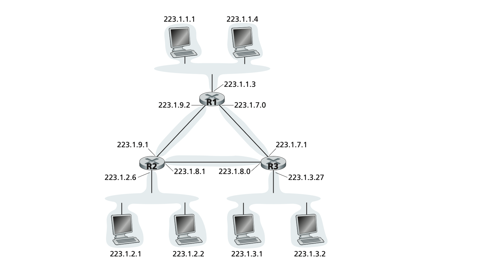
</p>

for a general interconnected system of routers and hosts, we can use teh following recipe to define the subnets in the system:

>  to determine the subnets, detach each interface from its host or router, creating islands of isolated networks, with interfaces terminating the end points of the isolated networks.  each of these isolated networks is called a **subnet**

in the figure above there are six islands / subnets.  the different subnets could have quite different subnet addresses.  their subnet addresses often have much in common typically.

lets see how addressing is handled in the global internet.  the internet's address assignment stategy is known as **classless interdomain routing** **cidr**.  cidr generalizes the notation of subnet addressing. as with subnet addressing, the 32 bit ip address is divided into two parts and again has the dotted-decimal form `a.b.c.d/x` where x indicates the number of bits in the first part of the address.

the x most significant bits of an address of the form `a.b.c.d/x` constitute the network portion of the ip address, and are often referred to as the **prefix** of the address.  an organization is typically assigned a block of contiguous addresses, that is, a range of addresses with a common prefix.  in this case, the ip addresses of devices within the organization will share the common prefix.  

the internets bgp routing protocol has only these `x` leading prefix bits which are considered by routers outside the organizations network.  that is, when a router outside the organization forwards a datagram whose destination address is inside the organization, only the leading `x` bits of the address need to be considered.  this reduces the size of the forwarding table in these routers, since a single entry of the form `a.b.c.d/x` will be sufficient to forward packets to any destination within the organization.

the remaining 32-x bits of an address can be thought of as distinguishing among the device within the organization all of which have the same network prefix.  these are the bits that will be considered when forwarding packets and routers within the organization.  these lower order bits may have an additional subnetting structure.

<p align="center">
    
    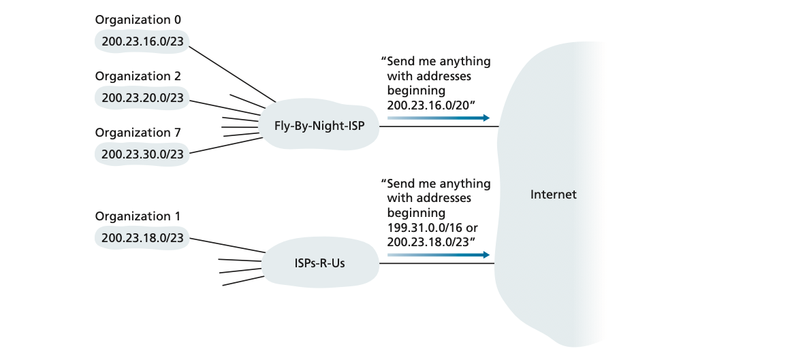
</p>

before cidr was adopted, the network portions of an ip address were constrained to be 8, 16, or 24 bits in length, an addressing scheme known as **classful addressing**.

the ip broadcast address `255.255.255.255.255` is used to send a packet to all devices on the same subnet.  when a host sends a datagram with destination address `255.255.255.255.255` the message is delivered to all hosts on that same subnet.  routers optionally forward the message into neighboring subnets as well.  

###  obtaining a block of addresses

in order to obtain a block of ip addresses for use within an organizations subnet, a network administrator might first contact its isp, which would provide addresses from a larger block of addresses that had already been allocated to the isp.  for example the isp may itself have been allocated the address block `200.23.16.0/20`.  the isp in turn could divide its address block into eight equal sized contiguous address blocks and give one of these address blocks out to each of up to eight organizations that are supported by this isp.

```
isp's block:        200.23.16.0/20    11001000 00010111 00010000 00000000
organization 0:     200.23.16.0/23    11001000 00010111 00010000 00000000
organization 1:     200.23.18.0/23    11001000 00010111 00010010 00000000
organization 2:     200.23.20.0/23    11001000 00010111 00010100 00000000
...
organization 7:     200.23.30.0/23    11001000 00010111 00011110 00000000
```

obtaining a set of addresses from an isp is not the only way to get a block of addresses.  there is a global authority that has ultimate responsibility for managing the ip address space and allocating address blocks to isps and other organizations.  this authority is **icann internet corporation for assigned names and numbers**, and it bases its guidelines set forth in rfc 7020.  the role of the non profit icann organization is not only to allocate ip addresses, but also to manage the dns root servers.  it also has the very contentious job of assigning domain name and resolving domain name disputes.  the icann allocates addresses to regional internet registries and handle the allocation/management of addresses within their regions.

###  obtaining a host address:  the dynamic host configuration protocol

once an organization has obtained a block of addresses, it can assign individual ip addresses to the host and router interfaces in its organization.  a system administrator will typically manually configure the ip addresses into the router.  host addresses can also be configured manually, but typically is done using the **dynamic host configuration protocol dhcp**.  dhcp allows a host to obtain an ip address automatically.  a network administrator can configure dhcp so that a given host receives the same ip address each time it connects to the network, or a host may be assigned a **temporary ip address** that will be different each time the host connects to the network.  in addition to host ip address assignment, dhcp also allows a host to learn additional information, such as its subnet mask, the address of its first hop router, and the address of its local dns server.

dhcp is a client server protocol.  a client is typically a newly arriving host wanting to obtain network configuration information, including an ip address for itself.  in the simplest case, each subnet will have a dhcp server.  if no server is present on the subnet, a dhcp relay agent (typically a router) that knows the address of a dhcp server for that network is needed.  the figure below shows a dhcp server attached to subnet `223.1.2/24`, with the router serving as the relay agent for arriving clients attached to subnets `223.1.1/24` and `223.1.3/24`.  

<p align="center">
    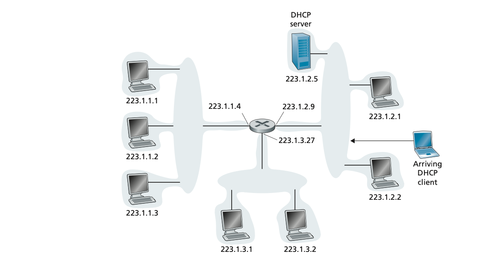
</p>

for a newly arriving host, the dhcp protocol is a four step process.  in this figure `yiaddr` known as "your internet address" indicates the address being allocated to the newly arriving client.  the four steps are as follows:

1.  **dhcp server discovery**  the first task of of a newly arriving host is to find a dhcp server with which to interact.  this is done using a **dhcp discover message**, which a client sends within a udp packet to port 67.  the udp packet is encapsulated in an ip datagram.  the dhcp client creates an ip datagram containing its dhcp discover message along with the broadcast destination ip address of `255.255.255.255` and a "this host" source ip address of `0.0.0.0`.  the dhcp client passes the ip datagram to the link layer which then broadcasts this frame to all nodes attached to the subnet.

2.  **dhcp server offers**  a dhcp server receiving a dhcp discover message responds to the client with a **dhcp offer message** that is broadcast to all nodes on the subnet, again using the ip broadcast address of `255.255.255.255`.  each server offer message contains the transaction id of the received discover message, the proposed ip address for the client, the network mask, and an ip **address lease time** - the amount of time for which the ip address will be valid.  its is common for the server to set the lease time to several hours or days.

3.  **dhcp request**  the newly arriving client will choose from among one or more server offers and respond to its selected offer with a **dhcp request message**, echoing back the configuration parameters.

4.  **dhcp ack**  the server responds to the dhcp request message with a **dhcp ack message**, confirming the requested parameters.  

<p align="center">
    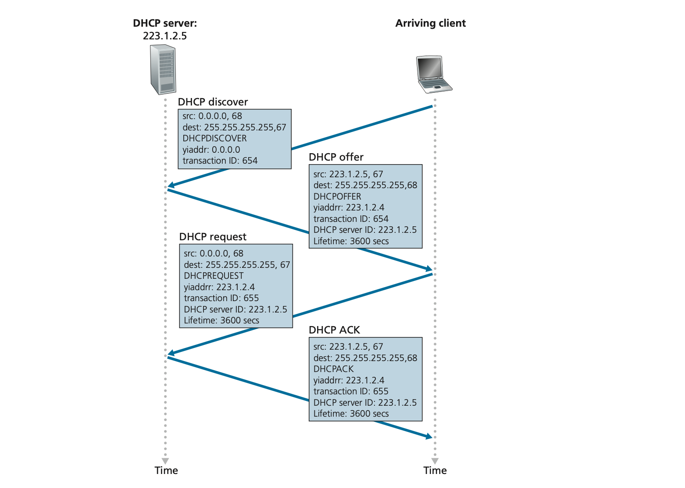
</p>

once the client receives the dhcp ack, the interaction is complete and the client can use the dhcp allocated ip address for the lease duration.  since a client may want to use its address beyond the lease's expiration, dhcp also provides a mechanism that allows a client to renew its lease on an ip address.

from a mobility aspect dhcp does have one very significant shortcoming.  since a new ip address is obtained from dhcp each time a node connects to a new subnet, a tcp connection to a remote application cannot be maintained as a mobile node moves between subnets.

##  network address translation nat

network address translation nat is a technique that allows a local network to use one set of ip addresses for internal traffic and a second set of addresses for external traffic.  the figure below shows the operation of a nat enabled router.  the nat enabled router, residing in the home, has an interface that is part of the home network on the right.  addressing within the home network is exactly as we have seen above - all four interfaces in the home network have the same subnet address of `10.0.0.0/24`.  the address space `10.0.0.0/8` is one of three portions of th eip address space that is reserved for a **private network** or a **realm with private addresses**, such as the home network.  a realm with private addresses refers to a network whose addresses only have meaning to devices within that network.  

the nat enabled router does not look like a router to the outside world.  instead the nat router behaves to the outside world as a single device with a single ip address.  all traffic leaving the home router for the larger internet has a source ip address of `138.76.29.7` and all traffic entering the home router must have a destination address of `138.76.29.7`.  in essence, the nat enabled router is hiding the details of the home network to the outside world.  

<p align="center">
    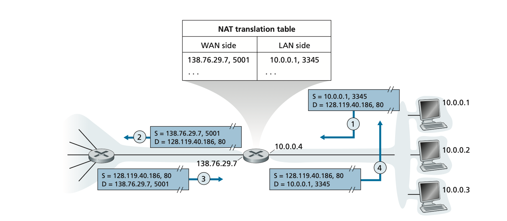
</p>

if all datagrams arriving at the nat router from a wan have the same destination ip address (specifically, that of the wan side interface of the nat router), then how does the router know the internal host to which it should forward a given datagram?  the trick is to use a **nat translation table** at the nat router, and to include port numbers as well as ip addresses in the table entries.

consider the example below suppose a user sitting in a home network behind host `10.0.0.1` requests a web page on some web server (port 80) with ip address `128.119.40.186`.  the host `10.0.0.1` assigns the arbitrary source port number `3345` and sends the datagram to the lan.  the nat router receives the datagram, generates a new source port number `5001` for the datagram, replaces the source ip address with its wan-side ip address `128.76.29.7`, and replaces the original source port number `3345` with the new source port number `5001`.  when generating a new source port number, the nat router can select any source port number that is not currently in the nat translation table.

1.  host `10.0.0.1` sends datagram to `128.119.40.186:80` with source port `3345`
2.  nat router changes datagram source address from `10.0.0.1`, `3345` to `138.76.29.7`, `5001` and updates the nat translation table
3.  the web server reply arrives, destination address `138.76.29.7`, `5001`

...

##  ipv6

the internet engineering task force began an effort to develop a successor to the ipv4 protocol.  a prime motivation for this effort was the realization that the 32-bit ipv4 address space was beginning to be used up, with new subnets and ip nodes being attached to the internet (and being allocated unique ip addresses) at a breathtaking rate.  to respond to this need for large ip address space, a new ip protocol, ipv6 was developed.  the designers of ipv6 also took this opportunity to tweat and augment other aspects of ipv4 based on teh accumulated operational experience with ipv4.

###  ipv6 datagram format

the format of the ipv6 datagram is shown in the figure below.  the most important changes introduced to ipv6 are evident in the datagram format.

-  expended addressing capabilities -  ipv6 increases the size of the ip address from 32 to 128 bits.  this ensures that the world won't run out of ip addresses.  additionally, ipv6 introduced a new type of address, called an **anycast address**, that allows a datagram to be delivered to any one of the group hosts.

-  streamlined 40 byte header -  a number of ipv4 fields have been dropped or made optional.  the resulting 40 byte fixed length header allows for faster processing of the ip datagram by a router.  a new encoding of options allows for more flexible options processing.

-  flow labeling -  ipv6 has an elusive definition of a flow.  rfc 2460 states that this allows labeling of packets belonging to particular flows for which the sender requests special handling, such as non-default quality of service or real-time service.  for example, audio and video transmission might likely be treated as a flow.  on the other hand, the more traditional applications such as file transfer and email might not be treated as flows.  it is possible that the traffic carried by a high-priority user might also be treated as a flow.

```
      <----------------------------------------- 32 bits ----------------------------------------->  
    +-----------------------------------------------------------------------------------------------+
    |        version   |  traffic class / priority     |                    flow label              |
    |-----------------------------------------------------------------------------------------------|
    |        payload length (bytes)                    |  next header     |  hop limit              |
    |-----------------------------------------------------------------------------------------------|
    |                               source ip address (128 bits)                                    |
    |-----------------------------------------------------------------------------------------------|
    |                               destination ip address (128 bits)                               |
    |-----------------------------------------------------------------------------------------------|
    |                               payload data                                                    |
    +-----------------------------------------------------------------------------------------------+
```

-  **version** -  4-bit field identifiers the ip version number
-  **traffic class** -  the 8 bit traffic class field, like the tos field in ipv4 can be used to give priority to certain datagrams within a flow, or it can be used to give priority to datagrams for certain applications over datagrams from other applications.
-  **flow label** -  this 20 bit field is used to identify a flow of datagrams.
-  **payload length** -  16 bit value is treated as an unsigned integer giving the number of bytes in the ipv6 datagram following the fixed length, 40 byte datagram header
-  **next header** -  this field identifies the protocol to which the contents (data field) of this datagram will be delivered.  the field uses the same valued as the protocol field in the ipv4 header.
-  **hop limit** -  the contents of this field are decremented by one by each router that forwards the datagram.  if the hop limit count reaches zero, a router must discard that datagram.
-  **source and destination addresses** -  the various formats of the ipv6 128 bit address.
-  **data** -  this is the payload portion of the ipv6 datagram.  when the datagram reaches its destination, the payload will be removed from the ip datagram and passed on to the protocol specified in the next header field.

**what is missing compared with ipv4?**

-  **no header checksum** -  because the transport layer and link layer protocol in the internet layers perform check summing, the designers of ip probably felt that this functionality was sufficiently redundant in the network layer that it could be removed.  fast processing of ip packets was a central concern.  
-  **no fragmentation / reassembly** -  ipv6 does not allow for fragmentation and reassembly at intermediate routers; these operations can be performed only by the source and destination.  if an ipv6 datagram received by a router is too large to be forwarded over the outgoing link,
-  **no options** available as upper-layer, next-header protocol at router.
  
###  transitioning from ipv4 to ipv6

the question comes in to play which is how will the public internet, which is based on ipv4, be transitioned to ipv6?  the problem is that while new ipv6 capable systems can be made backward-compatible, that is, can send, route, and receive ipv4 datagrams, already deployed ipv4 capable systems are not capable of handling ipv4 datagrams.  several options are available.

one option would be to declare a flag day - a given time and date when all internet machines would be turned off and upgraded from ipv4 to ipv6.  however this option is not feasible.

the approach to ipv4 to ipv6 transition that has been most widely adopted in practice involves **tunneling**.  suppose tow ipv6 nodes wanter to interoperate using ipv6 datagrams but are connected to each other by intervening ipv4 routers.  we refer to the intervening set of ipv4 routers between two ipv6 routers as a **tunnel**, illustrated in the figure below.

<p align="center">
    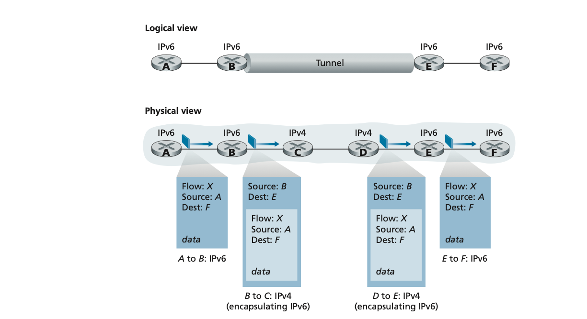
</p>

with tunneling the ipv6 node on the sending side of the tunnel takes the entire ipv6 datagram and puts it in the data (payload) field of an ipv4 datagram.  this ipv4 datagram is then addressed to the ipv6 node on the receiving side of the tunnel and sent to the first node in the tunnel.  the intervening ipv4 routers in the tunnel route this ipv4 datagram among themselves, just as they would any other datagrams, blissfully unaware that the ipv4 datagram itself contains a complete ipv6 datagram.  the ipv6 node on the receiving side of the tunnel eventually receives the ipv4 datagram, determines that the ipv4 datagrams contains an ipv6 datagram, extracts the ipv6 datagram, and then routes the ipv6 datagram exactly as it would if it had received the ipv6 datagram from a directly connected ipv6 neighbor.

##  generalized forwarding and sdn

recall that the previous section characterized destination based forwarding as the two steps of looking up a destination ip address ("match"), and then sending the packet into the switching fabric to the specified output port ("action").  now lets consider a significantly more general "match-plus-action" paradigm, where the match can be made over multiple header fields associated with different protocols at different layers in the protocol stack.  the action can include forwarding the packet to one or more output ports, load balancing packets across multiple outgoing interfaces that lead to a service, rewriting header values, purposefully blocking/dropping a packet, sending a packet to a special server for further processing and action, and more.  

in generalized forwarding, a match plus action table generalizes the notion of the destination based forwarding table.  because forwarding decision may be made using network layer and or link layer source and destination address, the forwarding devices shown in the figure below are more accurately described as packet switches rather than layer 3 routers or layer 2 switches.

the figure shows a match plus action table in each packet switch, with the table being computed, installed, and updated by a remote controller.  

<p align="center">
    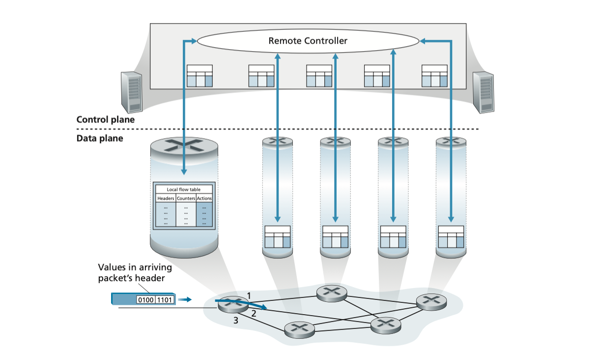
</p>

the following generalized forwarding will be based on open flow - a highly visible standard that has pioneered the notion of the match plus action forwarding abstraction and controllers, as well as the sdn revolution more accurately.  

each entry in the match plus action forwarding table, known as **flow table** in open flow includes,

-  **a set of header field values** to which an incoming packet will be matched.  as in the case of destination based forwarding, hardware based matching is most rapidly performed in tcam memory, with more than a million destination address entries being possible.  a packet that matches no flow table entry can be dropped or sent to the remote controller for more processing.  in practice a flow table may be implemented by multiple flow tables for performance or cost reasons.

-  **a set of counters** that are updated as packets are matched to flow table entries.  these counters might include the number of packets that have been matched by that table entry, and the time since the table entry was last updated.

-  **a set of actions to be taken** when a packet matches a flow table entry.  these actions might be to forward the packet to a given output port, to drop the packet, makes copies of the packet and sent them to multiple output ports, and/or to rewrite selected header fields.

in essence a flow table is essentially an api, the abstraction through which an individual packet switch's behavior can be programmed; we will see in the following sections that network wide behaviors can be programmed by appropriately programming/configuring these tables in a collection of network packet switches.

##  match

the figure below shows the 11 packet header fields and the incoming port id that can be matched in an openflow 1.0 match plus action rule.  recall that a link layer frame arriving to a packet switch will contain a network layer datagram as its payload, which in turn will typically contain a transport layer segment.  the first observation we make is that open flows match abstraction allows for a match to be made on selected fields from three layers of protocol headers.  since we have not yet covered the link layer suffice it to say that the source and destination mad addresses shown in the figure below are the link layer addresses associated with the frames sending and receiving interfaces.  by forwarding on the basis of ethernet addresses rather than ip addresses, we can see that an open flow enabled device can equally perform as a router forwarding datagrams as well as switch forwarding frames.  the ethernet type field corresponds to the upper layer protocol (e.g. ip) to which the frame's payload will be de-multiplexed and the vlan fields are concerned with so called virtual local area networks.  the set of 12 values that can be matched in the openflow 1.0 specifical has grown to 41 values in more recent openflow specifications.

<p>
    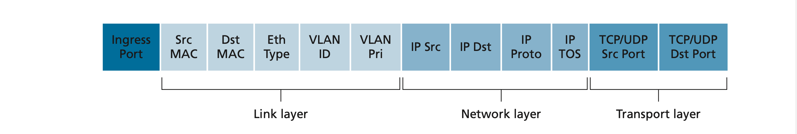
</p>

the ingress port refers to the input port at the packet switch on which a packet is received.  the packets ip source address, ip destination address, ip protocol field, and ip type of service fields were discussed earlier.  the transport layer source and destination port number fields can also be matched.

flow table entries may also have wildcards.  for example, an ip address of `128.119.*.*` in a flow table will match the corresponding address field of any datagram that has `128.119` as the first 16 bits of its address.  each flow table entry also has an associated priority.  if a packet matches multiple flow table entries, the selected match and corresponding action will be that of the highest priority entry with which the packet matches.

not all fields in the ip header can be matched.  for example openflow does not allow matching on the basis of ttl field or datagram length fields.  the reason for this is that these fields are not typically used in making forwarding decisions.  the openflow match abstraction is designed to be a simple and efficient way to make forwarding decisions.


##  action

each flow table entry has a list of zero or more actions that determine the processing that is to be applied to a packet that matches a flow table entry.  if there are multiple actions, they are performed in the order specified in the list.  among the most important possible actions are:

-  **forwarding** -  an incoming packet may be forwarded to a particular physical output port, broadcast over all ports or multicast over a selected set of ports.  the packet may be encapsulated and sent to the remote controller for this device.  that controller then may or may not take some action on that packet, including installing new flow table entries and may return the packet to the device for forwarding under the updated set of flow table rules.
   
-  **dropping** -  a flow table entry with no action indicates that a matched packet should be dropped.
  
-  **modify-field** -  the values in the 10 packet header field (all layer 2, 3, 4 fields except the ip protocol field) may be rewritten before the packet is forwarded to the chosen output port.
  

###  openflow examples of match plus action in action

having now considered both teh match and action components of generalized forwarding, let's put these ideas together in the context of the sample network shown in the figure below.  the network has 6 hosts h1, h2, h3, h4, h5, h6 and three packet switches s1, s2, s3, each with four local interfaces (numbered 1 through 4).  we will consider a number of network side behaviors that we'd like to implement and the flow table entries in s1, s2, and s3 needed to implement this behavior.  

<p>
    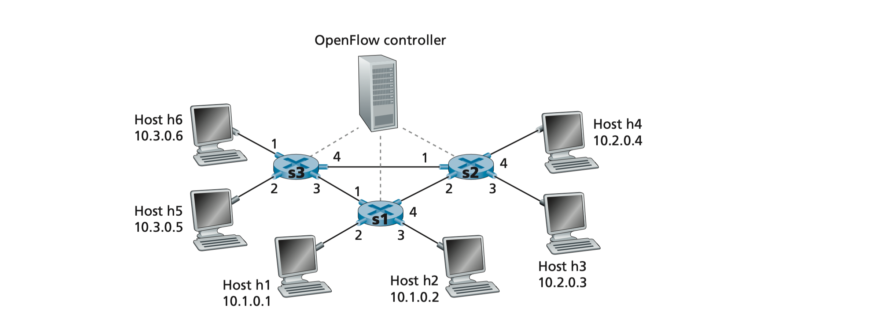
</p>

###  a first example:  simple forwarding

as a very simple example, suppose that the desired forwarding behavior is that packets from h5 or h6 destined to h3 or h4 are to be forwarded from s3 to s1, and then from s1 to s2.  the flow table entry in s1 would be

**s1 flow table example 1**

| match                                                        | action       |
|:-------------------------------------------------------------|:-------------|
| ingress port = `1`, ip src = `10.3.*.*`, ip dst = `10.2.*.*` | `forward(4)` |
| `...`                                                        | `...`        |

of course we will also need a flow table entry in s3 so that datagram sent from h5 or h6 are forwarded to s1 over outgoing interface 3.  the flow table entry in s3 would be

**s3 flow table example 1**

| match                                                        | action       |
|:-------------------------------------------------------------|:-------------|
| ip src = `10.3.*.*`, ip dst = `10.2.*.*`                     | `forward(3)` |
| `...`                                                        | `...`        |

lastly we will also need a flow table entry in s2 to complete this first example, so that datagrams arriving from s1 are forwarded to their destination, either host h3 or h4:

**s2 flow table example 1**

| match                                                        | action       |
|:-------------------------------------------------------------|:-------------|
| ingress port = `2`, ip dst = `10.2.0.3`                      | `forward(3)` |
| ingress port = `2`, ip dst = `10.2.0.4`                      | `forward(4)` |
| `...`                                                        | `...`        |


###  a second example:  load balancing

as a second example, let's consider a load balancing scenario, where datagrams from h3 destined to `10.1.*.*` are to be forwarded over the direct link between s2 and s1, while datagrams from h4 destined to `10.1.*.*` are to be forwarded over the link between s2 and s3 and then from s3 to s1.  note that this behavior couldn't be achieved with ip's destination based forwarding.  in this case, the flow table in s2 would be:

**s2 flow table example 2**

| match                                                        | action       |
|:-------------------------------------------------------------|:-------------|
| ingress port = `3`; ip dst = `10.1.*.*`                      | `forward(2)` |
| ingress port = `4`, ip dst = `10.1.*.*`                      | `forward(1)` |
| `...`                                                        | `...`        |

flow table entries are also needed at s1 to forward the datagrams received from s2 either h1 or h2; and flow table entries are needed at s2 to forward datagrams received on interface 4 from s2 over interface 3 toward s1.

###  middleboxes

routers accomplish their job of forwarding ip datagrams toward their destination.  we have also encountered other network equipment ("boxes") within the network that sit on the data path and perform functions other than forwarding.  we caches, tcp connection splitters, and network address translation, firewalls, and intrusion detection systems.  we learned that generalized forwarding allows a modern router to easily and naturally perform firewalling and load balancing with generalized match plus action operations.

**middleboxes** are any intermediary box performing functions apart from normal, standard functions of an ip router on the data path between a source host and a destination host.

there are three types of services performed by middleboxes:

-  **nat translation** -  nat boxes implement private network addressing, rewriting datagram header ip addresses and port numbers.
-  **security services** -  firewall block traffic based on header field values or redirects packets for additional processing, such as deep packet inspection (dpi).  instruction detection systems ids are able to detect predetermined patterns and filter packets accordingly.  application level e-mail filters block e-mails considered to be junk, phishing or otherwise posing a security threat.
-  **performance enhancement** -  these middleboxes perform services such as compression, content caching, and load balancing of service requests (e.g. an http request or a search engine query) to one of a set of servers that can provide the desired service.
  
a nat box sitting between a router and host, rewrites network layer ip addresses and transport layer port numbers, an in network firewall block suspect datagrams using application layer, transport layer, and network layer header field.  e-mail security gateways are injected between the e-mail sender and the intended e-mail receiver, filtering application layer e-mail messages based on whitelisted/blacklisted ip addresses as well as e-mail message content.  a load balancer sits between a set of servers and a set of clients, distributing incoming requests to the servers in a way that balances the load across the servers.

###  architectural principles of the internet

the goal of the internet is connectivity, the tool is the internet protocol, and the intelligence is end to end rather than hidden in the network.  the ip protocol would be placed at the network edge, rather than in the network core.

###  the ip hourglass

the five layer internet protocol stack is one visualization of the internet, but another one is sometimes known as the ip hourglass, it illustrates the narrow waist of the layered internet architecture.  while the internet has many protocols in the physical, link, transport, and application layers, there is only one network layer protocol - the ip protocol.  this is the one protocol that must be implemented by each and every of the billion of internet connected devices.  this narrow waist has played a critical role in the phenomenal growth of the internet.  the relative simplicity of the ip protocol, and the fact that is is the only universal requirement for internet connectivity has allowed a rich variety of networks with very different underlying link layer technologies, from ethernet to wifi to cellular to optical network to become part of the internet.  the role of the narrow waist which is referred to as the spanning layer is to hide the detailed difference among these various underlying technologies and present a uniform service interface to the applications above.  for the ip layer in particular defines a basic set of services, which were carefully designed so that they could be constructed from a wide range of underlying network technologies.  software as a part of the internet (e.g. network layer), translates what each of these lower layer technologies offer into the common service of the internet layer.

<p>
    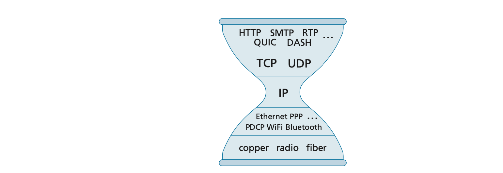
</p>

###  summary

in this chapter we've covered the data plane functions of the network layer - the per router functions that determine how packets arriving on one of a router's input links are forwarded to one of that router's output links.  we began by taking a detailed look at the internal operations of a router, studying input and output port functionality and destination based forwarding, a router's internal switching mechanism, packet queue management and more.  we covered both traditional ip forwarding (where forwarding is based on a datagram's destination address) and generalized forwarding (where forwarding and other functions may be performed using values in several different fields in the datagram's header) and seen the versatility of the latter approach.  we also studied the ipv4 and ipv6 protocols in detail, and internet addressing, which we found to be much deeper, subtler, and more interesting than we might have expected.  then we completed our study of the network layer data plane with a study of middleboxes, and a broad discussion of internet architecture.