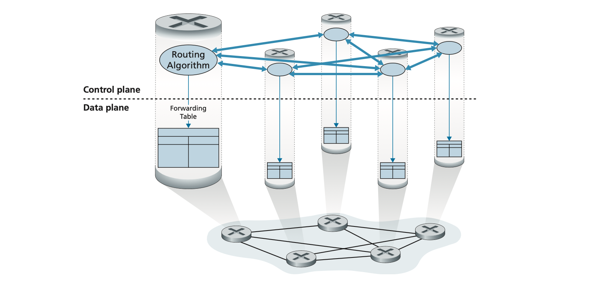
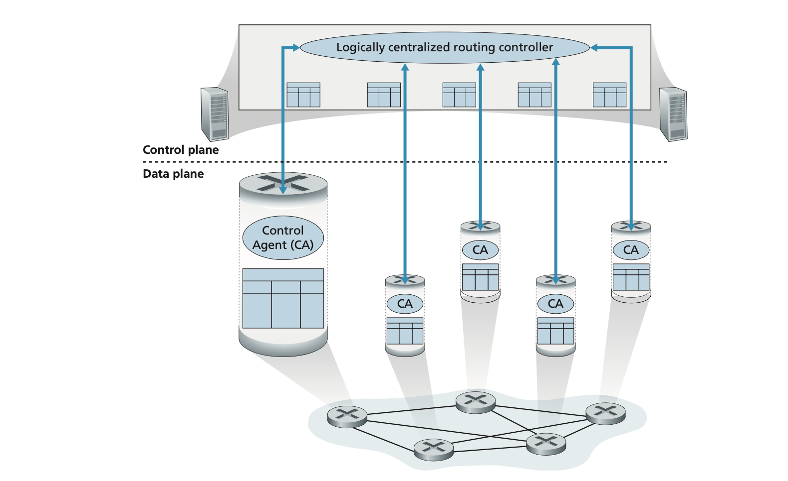
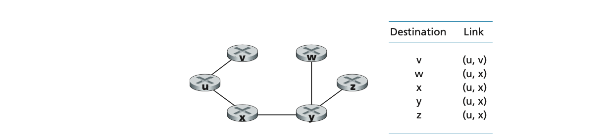
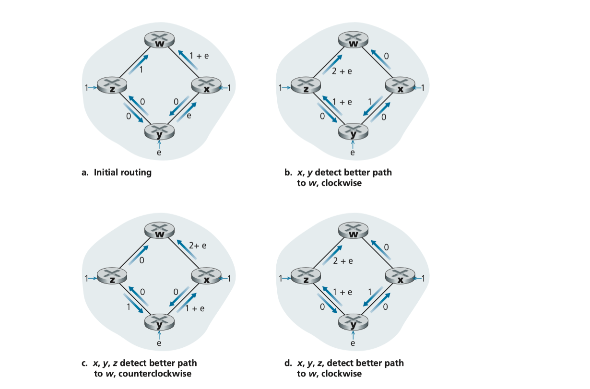
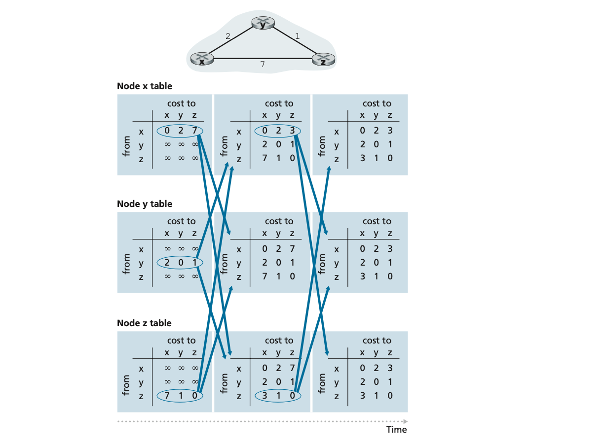
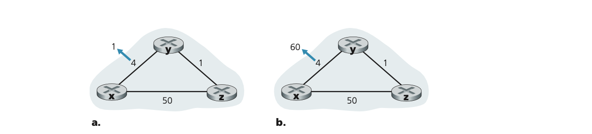

#  the network layer:  control plane

the control plane component of the network layer is the network wide logic that controls not only how a datagram is routed along an end to end path from source host to the destination host, but also how network layer components and services are configured and managed.  we will cover traditional routing algorithms for computing the least cost paths in a graph; these algorithms are the basis for two widely deployed internet routing protocols:  ospf and bgp.  ospf is a routing protocol that operates within a single isp network.  bgp is a routing protocol that serves to interconnect all of the networks in the internet;  bgp is thus often referred to as the glue that holds the internet together.  traditionally, control plane routing protocols have been implemented together with data plane forwarding functions, monolithically within a router.  as we learned in the introduction to the data plane, software defined networking snd makes a clear separation between the data and control planes, implementing control plane functions in a separate controller service that is distinct, and remote from the forwarding components of the router it controls.  we will cover snd controllers later in the section.

then we will cover some of the nuts and bolts of managing an ip network:  icmp (the internet control messaging protocol) and snmp (the simple network management protocol)

##  introduction

the forwarding table in the case of destination based forwarding and the flow table in the case of generalized forwarding we the principle elements that linked the network layer's data and control planes.  we learned that these tables specify the the local data plane forwarding behavior of a router.  we saw in the case of generalized forwarding, the actions taken could include not only forwarding a packet to a router's output port, but also dropping a packet, replicating a packet, and or rewriting layer 2, 3, or 4 packet header fields.

in this chapter we will study how those forwarding and flow tables are computed, maintained and installed.  in our introduction to the network layer we learned that there are two possible approaches for doing so.

-  **per router control**  the figure below illustrates the case where a routing algorithm runs in each and every router; both a forwarding and a routing function are contained within each router.  each router has a routing component that communicates with the routing components in other routers to compute the values for its forwarding table.  this per routing control approach has been used in the internet for decades.  the ospf and bgp protocols that we'll study are based on this per router approach to control.

<p>
    
</p>

-  **logically centralized control**  the figure below illustrates the case in which a logically centralized controller computes and distributes the forwarding tables to be used by each and every router.  as we saw in section 4.4 and 4.5, the generalized match-plus-action abstraction allows the router to perform traditional ip forwarding as well as a rich set of other functions such as load sharing, firewalling, and network address translation that has been previously implemented in separate middleboxes.

<p>
    
</p>

the controller interacts with a control agent in each of the routers via a well defined protocol to configure and manage that router's flow table.  typically the control agent has minimum functionality; its job is to communicate with the controller, and to do as the controller commands.  unlike the routing algorithms in the first figure the cas do not directly interact with each other nor do they actively take part in computing the forwarding table.  this is a key distinction between per router control and logically centralized control.  

by logically centralized control we mean that the routing control service is accessed as if it were a single central service point, even though the service is likely to be implemented via multiple servers for fault tolerance, and performance scalability reasons.  as we see, sdn adopts this notion of a logically centralized controller - an approach that is finding increased use in production deployments.  google uses sdn to control the routers in its internal b4 global wide area network that inter connects its data centers.  swan, from microsoft research, uses a logically centralized controller to manage routing and forwarding between a wide area network and a data center network.  major isp deployments, including com cast's activecore and deutsche telecom access 4.0 are actively integrating sdn into their networks.  sdn control is central to 4g/5g cellular networking as well.  by the end of next year, 75% of our network functions will be fully virtualized and software controlled.  

##  routing algorithms

in this section we will study **routing algorithms** whose goal is to determine good paths (equivalently, routes), from senders to receivers, through the network of routers.  typically a good path is one that has the least cost.  we will see that in practice, however real world concerns such as policy issues also come into play.  we note that whether the network control plane adopts per router control approach or a logically centralized approach, there must always be a well defined sequence of routers that a packet will cross in traveling from sending to receiving host.  thus the routing algorithms that compute these paths are of fundamental importance, and another candidate for our top 10 list of fundamentally important networking concepts.  

a graph is used to formulate routing problems.  recall that graph g = (n, e) is a set of n nodes and a collection of e edges, where each edge is a pair of nodes from n.  in the context of network layer routing, the nodes in the graph represent routers - the point at which packet forwarding decisions are made - and the edges connecting these nodes represent the physical links between these routers.  such a graph abstraction of a computer network is show in the figure below.  when we study the bgp inter-domain routing protocol, we will see that nodes represent networks, and the edge connecting two such nodes represents direction connectivity (known as peering) between the two networks.  

as shown in the figure below an edge also has a value representing its cost.  typically an edge's cost may reflect the physical length of the corresponding link, the link speed, or the monetary cost associated with a link.  for our purposes, well simply take the edge costs as a given and won't worry about how they are determined.  for any edge (x, y) in E, we denote c(x, y) as the cost of the edge between nodes x and y.  if the pair (x, y) does not below to E, we set c(x, y) = ∞.  also we will only consider undirected graphs in our discussion here, so that edge (x, y) is the same as edge (y, x) and that c(x, y) = c(y, x);  however the algorithms we will study can be easily extended to the case of directed links with a different cost in each direction.  also a node y is said to be a **neighbor** of node x if (x, y) belongs to E.

<p>
    
</p>

given that costs are assigned to the various edges in the graph abstraction, a natural goal of a routing algorithm is to identify the least costly paths between sources and destinations.  to make this problem more precise, recall that a **path** in a graph G = (N, E) is a sequence of nodes $(x_1, x_2, \cdots, x_p)$ such that each of the pairs $(x_1, x_2), (x_2, x_3), \cdots, (x_{p - 1}, x_p)$ are edges in E.  the cost of a path $(x_1, x_2, \cdots, x_p)$ is simply the sum of all the edge costs along the path, that is, $c(x_1, x_2) + c(x_2, x_3) + \cdots + c(x_{p -1}, x_p)$.  given any two nodes x and y, there are typically paths between the two nodes, with each path having a cost.  one or more of these paths is a **least-cost path**.  the least cost problem is therefore clear:  find a path between the source and destination that has least cost.  in the figure above for example, the least cost path between source node u and destination node w is (u, x, y, w) with a path cost of 3.  node that if all edges in the graph have tha same cost, the least cost path is also the **shortest path** (that is, the path with the smallest number of links between the source and the destination).

one way in which we can classify routing algorithms is according to whether they are centralized or decentralized.

-  a **centralized routing algorithm** computes the least cost path between a source and destination using complete global knowledge about the network.  that is, the algorithm takes the connectivity between all nodes and all link costs as inputs.  this then requires that the algorithm somehow obtain this information before actually performing the calculation.  the calculation itself can be run at one site or could be replicated in teh routing component of each and every router.  the key distinguished feature here, however, is that the algorithm has complete information about connectivity and link costs.  algorithms with global state information are often referred to as **link state algorithms**, since the algorithm must be aware of the cost of each link in the network.

-  in a **decentralized routing algorithm**, the calculation of the least cost path is carried out in an iterative, distributed manner by the routers.  no node has complete information about the costs of all network links.  instead each node begins with only the knowledge of the costs of its own directly attached links.  then, through an iterative process of calculation and exchange of information with its neighboring nodes, a node gradually calculates the least cost path to a destination or a set of destinations.  the decentralized routing algorithm we will study is called a distance vector algorithm, because each node maintains a vector of estimates of the costs (distances) to all other nodes in the network.  such decentralized algorithms, with interactive message exchange between neighboring routers is perhaps more naturally suited to control planes where the routers interact directly with each other.  

a second broad way to classify routing algorithms is according to whether they are static or dynamic.  in **static routing algorithms**, routes change very slowly over time, often as a result of human intervention.  **dynamic routing algorithms** change the routing paths as the network traffic loads or topology change.  a dynamic algorithm can be run either periodically or in direct response to topology or link cost changes.  while dynamic algorithms are more responsive to network changes, they are also more susceptible to problems such as routing loops and route oscillation.

###  the link state routing algorithm

in a link state algorithm, the network topology and all link costs are known, that is, available as input to the ls algorithm.  in practice this is accomplished by having each node broadcast link state packets to all other nodes in the network,  with each link state packet containing the identities and costs of its attached links.  in practice this is often accomplished by a **link state broadcast** algorithm.  the result of the nodes broadcast is that all nodes have an identical and complete view of the network.  each node can then run the ls algorithm and compute the same set of least cost paths as every other node.

the link state routing algorithm we present below is known as dijkstra's algorithm.  a closely related algorithm is prim's algorithm.  dijkstra's algorithm computes the least cost path from one node (the source, which we will refer to as u) to all other nodes in the network.  dijkstra's algorithm is iterative and has the property that after the kth iteration of the algorithm, the least cost paths are known to k destination nodes, and among the least cost paths to all destination nodes, these k paths will have the k smallest costs.  lets define the following notation.

-  $D(v)$:  cost of the least cost path from the source node to destination v as of this iteration of the algorithm.
-  $p(v)$:  previous node (neighbor of v) along the current least cost path from the source to v.
-  $N'$:  subnet of nodes; v is in $N'$ if the least cost path from the source to v is definitively known.

the centralized routing algorithm consists of an initialization step followed by a loop.  the number of times the loop is executed is equal to the number of nodes in the network.  upon termination, the algorithm will have calculated the shortest paths from the source node u to every other node in the network.

**link state algorithm for source node u**

```
initialization:
    N' = {u}
    for all nodes v
        if v is a neighbor of u
            then D(v) = c(u, v)
        else 
            D(v) = ∞
loop
    find w not in N' such that D(w) is a minimum
    add w to N'
    update D(v) for each neighbor v of w and not in N':
        D(v) = min(D(v), D(w) + c(w, v))
    /* new cost to v is either old cost to v or known least cost to w plus cost from w to v */
until N' = N
```

as an example, let's consider the network in nearest figure above and compute the least cost paths from u to all possible destinations.  a tabular summary of the algorithm's computation is shown in the table below, where each line in the table gives the values of the algorithm's variables at the end of the iteration.  let's consider the few first steps in detail.

| step | N'      | D(v), p(v) | D(w), p(w) | D(x), p(x) | D(y), p(y) | D(z), p(z) |
|:----:|:-------:|:----------:|:----------:|:----------:|:----------:|:----------:|
| 0    | u       | 2, u       | 5, u       | 1, u       | ∞          | ∞          |
| 1    | ux      | 2, u       | 4, x       |            | 2, x       | ∞          |
| 2    | uxy     | 2, u       | 3, y       |            |            | 4, y       |
| 3    | uxyv    |            | 3, y       |            |            | 4, y       |
| 4    | uxyvw   |            |            |            |            | 4, y       |
| 5    | uxyvwz  |            |            |            |            |            |

-  in the initialization step, the currently known least cost path from u to its directly attached neighbors v, x, and w are initialized to 2, 1, and 5 respectively.  the costs to y and z are set to ∞ because they are not directly connected to u.
  
-  in the first iteration, we look among those nodes not yet added to the set $N'$ and find that node with the least cost as of the end of the previous iteration.  that node is x, with a cost of 1, and thus x is added to the set $N'$.  line 12 of the ls algorithm is then performed to update $D(v)$ for all node v, yielding the results shown in the second line step 1 in the table.  the cost of the path to v is unchanged.  teh cost of the path to w through node x is found to have a cost of 4.  hence this lower cost path is selected and w's predecessor along the shortest path from u is set to x.  similarly, the cost to y through x is computed to be 2, and the table is updated accordingly.

-  in the second iteration, nodes v and y are found to have the least cost paths and we break the tie arbitrarily and add y to the set $N'$ so that $N'$ now contains u, x, and y.  the cost of the remaining nodes not in $N'$, that is nodes v, w, and z are updated via line 12 of the ls algorithm yielding the results shown in the third row.

-  and so on...
  
when the ls algorithm terminates, we have, for each node its predecessor along the least cost path from the source node.  for each predecessor, we also have its predecessor, and so on in this manner we can can construct the entire path from the source to all destinations.  the forwarding table in a node, say node u, can then be constructed from this information by storing, for each destination, the next hop node on the least cost path from u to the destination.  the figure below shows the resulting least cost paths and forwarding table in u for the network.

<p>
    
</p>

what is the computational complexity of this algorithm?  that is, given n nodes, not counting the sour node, how much computation must be done in the worst case to find the least cost paths from the source to all destinations>  in the first iteration, we need to search through all n nodes to determine the node, w, not in $N'$ that has the minimum cost; in the third iteration n - 2 nodes, and so on.  overall the total number of nodes we need to search through over all iterations is n(n + 1)/2, and thus we say that the preceding implementation of the ls algorithm has worst case complexity of ordre n squared: $O(n^2)$.

<p>
    
</p>

the figure above shows a simple network topology where link costs are equal to the load carried on the link, for example reflecting the delay that would be experienced.  in this example, link costs are not symmetric; that is, c(u, v) equals example, node z originates a unit of traffic destined for w, node x also originates a unit of traffic destined for w, and node y injects an amount of traffic equal to w, also destined for w.  the initial routing is shown in figure a with the link costs corresponding to the amount of traffic carried.

when the ls algorithm is next run, node y determines (based on the link costs shown in figure a) that the clockwise path to w has a cost of 1, while the counterclockwise path w has a cost of 1 + e.  hence y's least cost path to w is now clockwise.  similarly, x determines that its new least cost path to w is also clockwise, resulting in costs shown in figure b.  when the ls algorithm is run next, nodes x, y, and z all detect a zero cost path to w in the counterclockwise direction, and all route their traffic to the counterclockwise routes.  the next time the ls algorithm is run, x, y, and z all the route their traffic to the clockwise routes.

what can be done to prevent such oscillations (which can occur in any algorithm, not just an ls algorithm, that uses a congestion or delay based link metric)?  one solution would be to mandate that link costs not depend on the amount of traffic carried - an unacceptable solution since one goal of routing is to avoid highly congested links.  another solution is to ensure that not all routers run the ls algorithm at the same time.  this seems a more reasonable solutions, since we would hope that even if routers ran the ls algorithm with the same periodicity, the execution instance of the algorithm would not be the same at each node.  

###  the distance vector routing algorithm

whereas the ls algorithm is an algorithm using global information, the **distance vector dv** algorithm is iterative, asynchronous, and distributed.  it is distributed in that each node receives some information from one or more of its directly attached neighbors, performs a calculation, and then distributes the results of its calculation back to its neighbors.  it is iterative in that this process continues on until no more information is exchanged between neighbors.  the algorithm is asynchronous in that it does not require all of the nodes to operate in lockstep with each other.  

before we present the dv algorithm, it will provide beneficial to discuss an important relationship that exists among the costs of the least cost paths.  let $d_x(y)$ be the cost of the least cost path from node x to node y.  then the least costs are related by the celebrated bellman-ford equation:

$$d_x(y) = \text{min}_v\{c(x, v) + d_v(y)\}$$

where the $\text{min}_v$ in the equation is taken over all of x's neighbors.  the bellman ford equation is rather intuitive.  indeed, after traveling from x to v, if we then take the least cost path from v to y, the path cost will be $c(x, v) + d_v(y)$.  since we must begin by traveling to some neighbor v, the least cost from x to y is the minimum of $c(x, v) + d_v(y)$ taken over all neighbors v.

let's check for the validity of the equation for source node u to destination node z in the figure below.  the source node u has three neighbors:  node v, x, and w.  by walking along various paths in the graph, it is easy to see that $\text{d}_\text{v}\text{(z)} = 5$, $\text{d}_\text{x}\text{(z)} = 3$, and $\text{d}_\text{w}\text{(z)} = 3$.  plugging these values into the equation along with the costs $\text{c(u, v)} = 2$, $\text{c(u, x) = 1}$, $\text{c(u, w) = 5}$ gives us 
$\text{d}_\text{u}\text{(z)} = \text{min} \{ 2 + 5, 5 + 3, 1 + 3 \} = 4$, which is obviously true and which is exactly what the dijskstra algorithm gave us for the same network.  this quick verification should help relieve any skepticism you may have.

<p>
    
</p>

the bellman ford question is not just an intellectual curiosity.  it actually has significant practical importance:  the solution to the bellman ford equation provides the entries in node x's forwarding table.  to see this, let v* be any neighboring node that achieves the minimum in the equation.  then if node x wants to send a packet to node y along a least cost path, it should first forward the packet to node v*.  thus, node x's forwarding table would specify node v* as the next hop router for the ultimate destination y.  another important practical contribution of the bellman ford equation is that it suggests the form of the neighbor to neighbor communication that will take place in the dv algorithm.

the basic idea is as follows.  each node x begins with $\text{D}_\text{x}\text{(y)}$, an estimate of the cost of the least cost path from itself to node y, for all nodes, y in N.  let $\text{D}_\text{x} = [\text{D}_\text{x}\text{(y)} : y \in N]$ be node x's distance vector, which is the vector of cost estimates from x to all other nodes, y in N.  with the dv algorithm, each node x maintains the following routing information:  

-  for each neighbor v, the cost c(x, v) from x to directly attached neighbor, v
-  node x's distance vector, that is, $\text{D}_\text{x} = [\text{D}_\text{x} \text{(y)} : y \in N]$, containing x's estimate of its cost to all destinations, y, in N.
-  the distance vectors of each of its neighbors, that is, $\text{D}_\text{v} = [\text{D}_\text{v} \text{(y)} : y \in N]$ for each neighbor v of x
  
in the distributed, asynchronous algorithm, from time to time, each node sends a copy of its distance vector to each of its neighbors.  when a node x receives a new distance vector from any of its neighbors w, it saves w's distance vector, and then uses the bellman ford equation to update its own distance vector as follows:

$$\text{D}_\text{x}\text{(y)} = \text{min} \{ \text{c(x, y)} + \text{D}_\text{v}\text{(y)} \} \text{ for each node y in N}$$

if node x's distance vector has changed as a result of this update step, node x will then send its updated distance vector to each of its neighbors, which can in turn update their own distance vectors.  miraculously enough, as long as all the nodes continue to exchange their distance vectors in an asynchronous fashion, each cost estimate $\text{D}_\text{x}\text{(y)}$, the actual cost of the least cost path from node x to node y.

###  distance vector dv algorithm

at each node x

```
initialization:
    for all destinations y in N:
        D_x(y) = c(x, y) /* if y is not a neighbor then c(x, y) = ∞ */
    for each neighbor w
        D_w(y) = ? for all destinations y in N
    for each neighbor w
        send distance vector D_x = [D_x(y) : y in N] to w

loop
    wait (until i see a link cost change to some neighbor w or
          until i receive a distance vector from some neighbor w)
    
    for each y in N:
        D_x(y) = min_v{c(x, v) + D_v(y)}

if D_x(y) changed for any destination y
    send distance vector D_x = [D_x(y) : y in N] to all neighbors

forever
```

in the dv algorithm, a node x updates its distance vector estimate when it either sees a cost change in one of its directly attached links or receives a distance vector update from some neighbor.  but update its own forwarding table for a given destination y, what node x really needs to know is not the shortest path distance to y but instead the neighboring node v*(y) that is the next hop router along the shortest path to y.  as you might expect, the next hop router v*(y) is the neighbor v that achieves the minimum line 14 of the dv algorithm.  for each destination y, node x also determines v*(y) and updates its forwarding table for destination y.

recall that the ls algorithm is a centralized algorithm in the sense that it requires each node to first obtain a complete map of the network before running the dijkstra algorithm.  the dv algorithm is decentralized and does not use such global information.  indeed, the only information a node will have is the costs of the links to its directly attached neighbor and information it receives from these neighbors.  each node waits for an update from any neighbor, calculates its new distance vector when receiving an update, and distributes its new distance vector to its neighbors.  dv like algorithms are used in many routing protocols in practice, include the internet's rip, bgp, iso idrp, novell ipx, and the original arpanet.

the figure below illustrates the operation of the dv algorithm for the simple three node network shown at the top of the figure.  the operation of the algorithm is illustrated in a synchronous manner,where all nodes simultaneously receive distance vectors from their neighbors, compute their new distance vectors, and inform their neighbors if their distance vectors have changed.  after studying this example, you should convince yourself that the algorithm operates correctly in an asynchronous manner as well, with node computations and update generation/reception occurring at any time.

<p>
    
</p>

the leftmost column of the figure displays three initial **routing tables** for each of the three nodes.  for example, the table in the upper-left corner is node x's initial routing table.  within a specific routing table, each row is a distance vector - specifically, each node's routing table includes its own distance vector and that of each of its neighbors.  thus, the first row in node x's initial routing table is $\text{D}_\text{x} = [\text{D}_\text{x}\text{(x)}, \text{D}_\text{x}\text{(y)}, \text{D}_\text{x}\text{(z)}] = [0, 2, 7]$.  the second and third rows in this table are the most recently received distance vectors from nodes y and z, respectively.  because at initialization node x has not received anything from node y or z, the entries in the second and third rows are initialized to infinity.

after initialization, each node sends its distance vector to each of its two neighbors.  this is illustrated in the figure by the arrows from the first column of tables to the second column of tables.  for example node x sends its distance vector $D_{x} = [0, 2, 7]$ to both nodes y and z.  after receiving the updates, each node recomputes its own distance vector.  for example, node x computes.

$$\text{D}_\text{{x}}\text{(x)} = 0$$

$$\text{D}_\text{x}\text{(y)} = \text{min} \{ c(x, y) + D_y(y), c(x, z) + D_z(y) = \text{min} \{ 2 + 0, 7 + 1 \} = 2 \}$$

$$\text{D}_\text{x}\text{(z)} = \text{min} \{ c(x, y) + D_y(z), c(x, z) + D_z(z) = \text{min} \{ 2 + 1, 7 + 0 \} = 3 \}$$

the second column therefore displays, for each node, the node's new distance vector along with distance vectors just received from its neighbors.  node, for example, that node x's estimate for the least cost node z $D_x(z)$ has changed from 7 to 3.  also node that for node x, neighboring node y achieves the minimum of the dv algorithm; thus at this stage of the algorithm, we have at node x that v*(y) = y and v*(z) = y.

after the nodes recompute their distance vectors, they again send their updated distance vectors to their neighbors (if there has been a change).  this is illustrated in the figure by the arrows from the second column of tables to the third column of tables.  note that only nodes x adn z send updates:  node y's distance vector didn't change so node y doesn't send an update.  after receiving the updates, the nodes then recompute their distance vectors adn update their routing tables, which are shown in the third column.

the process of receiving updated distance vectors from neighbors, recomputing routing table entries, and informing neighbors of changed costs of the least cost path to a destination continues until no update messages are sent.  at this point, since update messages are sent, no further routing table calculations will occur and the algorithm will enter a quiescent state; that is, all nodes will performing the wait in of the dv algorithm.  the algorithm remains in the quiescent state until a link cost changes, as discussed next.

###  distance vector algorithm:  link cost changes and link failure

when a node running the dv algorithm detects a change in the link cost from itself to a neighbor, it updates its distance vector and, if there's a change in the cost of the least cost path, informs its neighbors of its new distance vector.  the figure below illustrates a scenario where the link cost from y to x changes from 4 to 1.  we focus here only on y' and z's distance table entries to destination x.  the dv algorithm causes the following sequence of events to occur:

-  at time $t_{0}$, y detects the link cost change (the cost has changed from 4 to 1), updates its distance vector, and informs its neighbors of this change since its distance vector has changed.

-  at time $t_{1}$, z receives the update from y and updates its table.  it computes a new least cost to x and sends its new distance vector to its neighbors.
  
-  at time $t_{2}$, y receives z's update and updates its distance table.  y's least costs do not change and hence y does not send any message to z.  the algorithm comes to a quiescent state.
  
thus, only two iterations are required for the dv algorithm to reach a quiescent state.  the good news about the decreased cost between x and y has propagated quickly through the network.

let's now consider what can happen when a link cost increases.  suppose that the link cost between x and y increases from 4 to 60, as shown in the figure.

<p>
    
</p>

1.  before the link cost changes $D_y(x) = 4$, $D_y(z) = 1$, $D_z(x) = 5$ at time $t_0$ y detects the link cost change y. at time $t_0$, y detects the link cost change.  y computes its new minimum cost path to x to have a cost of 

$$D_y(x) = \text{min} \{ c(y, x) + D_x(x), c(y, z) + D_z(x)\} = \text{min} \{ 60 + 0, 1 + 5 \} = 6$$ 

of course with our global view of the network, we can see that this new cost via z is wrong.  but the only information node y has is that its direct cost to x is 60 and that z has last told y that z could get to x with a cost of 5.  so in order to get to x, y would now route through z, fully expecting that z will be able to get to x with a cost of 5.  as of $t_1$ we have a **routing loop** - in order to get to x, routes through z, and z routes through y.  a routing loop is like a black hole - a packet two nodes forever (or until the forwarding tables are changed).

2.  since node y has computed a new minimum cost to x, it informs z of its new distance vector at time $t_1$

3.  sometimes after $t_1$, z receives y's new distance vector, which indicates that y's minimum cost to x is 6.  z knows iit can get to y with a cost of 1 and hence computes a new least cost to x of $D_z(x) \text{min} \{ 50 + 0, 1 + 6\} = 7$.  since z's least cost to x has increased, it then informs y of its new distance vector at $t_2$.

4.  in a similar manner, after receiving z's new distance vector, y determines $D_y(x) = 8$ and sends z its distance vector.  z then determines $D_z(x) = 9$ and sends y its distance vector, and so on.

how long will this process continue?  you should convince yourself that the loop will persist for 44 iterations - until z eventually computes the cost of its path via y to be greater than 50.  at this point, z will determine that its least cost path to x via its direct connection to x.  y will then route to x via z.  the result of the bad news about the increase in link cost has indeed traveled slowly!  what would have happened if the link cost c(y, x) had changed from 4 to 10,000 and the cost c(z, x) had been 99,999?  because of such scenarios, the problem we have seen is sometimes referred to as the count to infinity problem.

##  intra as routing in the internet:  ospf

in our study of routing algorithms so far, we've viewed the network simply as a collection of interconnected routes.  one router was indistinguishable from another in the sense that all router executed the same routing algorithm to compute routing paths through the entire network.  in practice, this model and its view of a homogenous set of routers all executing the same routing algorithm is simplistic for two important reasons:

-  scale.  as the number of routers becomes large, the overhead involved in communicating, computing, and storing routing information becomes prohibitive.  today's internet consists of hundreds of millions of routers.  storing routing information for possible destinations at each of these routers would clearly require enormous amounts of memory.  the overhead required to broadcast connectivity and link cost updates among all of the routers would be huge.  a distance vector algorithm that iterated among all of the routers would be huge.  a distance vector algorithm that iterates among such a large number of routers would surely never converge.  clearly something must be done to reduce the complexity of route computation in a network as large as the internet.

-  administrative autonomy.  the internet is a network of isps, with each isp consisting of its own network of routers.  an isp generally desires to operate its network as it pleases or to hide aspects of its network's internal organization from the outside.  ideally an organization should be able to operate and administer its network as it wishes, while still being able to connect its network to other outside networks.

both of these problems can be solved by organizing routers into autonomous systems, with each as consisting of a group of routers that are under the same administrative control.  often the routers in an isp and the links that interconnect them, constitute a single as.  some isps however, partition their network into multiple as's.  in particular, some tier-1 isps use one gigantic as for their entire network, whereas other break up their isp into tens of interconnected as's.  an autonomous system is identified by its globally unique autonomous system number.  as numbers, like ip addresses, are assigned by icann regional registries.

routers within the sam eas all run the same routing algorithm and have information about each other.  the routing algorithm running within an autonomous system is called an **intra-autonomous system routing protocol**.


